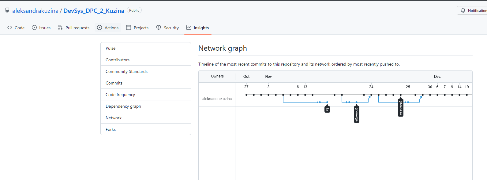

# Домашнее задание к занятию «2.2. Основы Git»

*Ссылка на ДЗ:https://github.com/netology-code/sysadm-homeworks/blob/devsys10/02-git-02-base/README.md*

## Задание №1 – Знакомимся с gitlab и bitbucket

> Иногда при работе с git-репозиториями надо настроить свой локальный репозиторий так, чтобы можно было отправлять и принимать изменения из нескольких удалённых репозиториев. Это может понадобиться при работе над проектом с открытым исходным кодом, если автор проекта не дает права на запись в основной репозиторий. Либо некоторые распределенные команды используют такой принцип работы, когда каждый разработчик имеет свой репозиторий, а в основной репозиторий пушатся только конечные результаты работы над задачами.

>Так же у DevOps-специалиста должен быть хороший кругозор, поэтому давайте познакомимся с gitlab и bitbucket.

>Создадим аккаунт в https://gitlab.com, если у вас его еще нет:


1. Gitlab. Страница регистрации [https://gitlab.com/users/sign_up](https://gitlab.com/users/sign_up), для регистрации можно использовать
   аккаунт google, github и другие.
2. После регистрации или авторизации в gitlab создайте новый проект, нажав на ссылку `Create a projet`.
   Желательно назвать также, как и в гитхабе `devops-netology` и `visibility level` выбрать `Public`.
3. Галочку `Initialize repository with a README` луше не ставить, чтобы не пришлось разрешать конфликты.
4. Если вы зарегистрировались при помощи аккаунта в другой системе и не указали пароль, то увидите сообщение
   `You won't be able to pull or push project code via HTTPS until you set a password on your account`.
   Тогда перейдите по ссылке из этого сообщения ([https://gitlab.com/profile/password/edit](https://gitlab.com/profile/password/edit))
   и задайте пароль.
   Если вы уже умеете пользоваться ssh ключами, то воспользуйтесь этой
   возможностью (подробнее про ssh мы поговорим в следующем учебном блоке).
5. Перейдите на страницу созданного вами репозитория, url будет примерно такой:
   [https://gitlab.com/YOUR_LOGIN/devops-netology](https://gitlab.com/YOUR_LOGIN/devops-netology) и изучите предлагаемые варианты для начала работы в репозитории в секции
   `Command line instructions`.
6. Запомните вывод команды `git remote -v`.
7. В связи с тем, что это будет наш дополнительный репозиторий, ни один вариант из перечисленных в инструкции (на странице
   вновь созданного репозитория) нам не подходит. Поэтому добавляем этот репозиторий как дополнительный `remote` к созданному
   репозиторию в рамках предыдущего домашнего задания:
   `git remote add gitlab https://gitlab.com/YOUR_LOGIN/devops-netology.git`.
8. Отправьте изменения в новый удалённый репозиторий `git push -u gitlab main`.
9. Обратите внимание как изменился результат работы команды `git remote -v`.


>Теперь необходимо проделать все тоже самое с https://bitbucket.org.

1. Обратите внимание, что репозиторий должен быть публичным, то есть отключите галочку `private repository` при создании репозитория.
2. И на вопрос `Include a README?` отвечаем отказом.
3. В отличии от гитхаба и гитлаба, в битбакете репозиторий должен принадлежать проекту, поэтому во время создания репозитория
   надо создать и проект, который можно назвать, например, `netology`.
4. Аналогично gitlab, на странице вновь созданного проекта выберите `https`, чтобы получить ссылку и добавьте этот репозиторий как
   `git remote add bitbucket ...`.
5. Обратите внимание, как изменился результат работы команды `git remote -v`.

>Если все проделано правильно, то результат команды `git remote -v` должен быть следующий:

```shell position-relative overflow-auto
$ git remote -v
bitbucket https://andreyborue@bitbucket.org/andreyborue/devops-netology.git (fetch)
bitbucket https://andreyborue@bitbucket.org/andreyborue/devops-netology.git (push)
gitlab	  https://gitlab.com/andrey.borue/devops-netology.git (fetch)
gitlab	  https://gitlab.com/andrey.borue/devops-netology.git (push)
origin	  https://github.com/andrey-borue/devops-netology.git (fetch)
origin	  https://github.com/andrey-borue/devops-netology.git (push)
```

>Дополнительно можете так же добавить удалённые репозитории по `ssh`, тогда результат будет примерно такой:

```shell position-relative overflow-auto
git remote -v
bitbucket	git@bitbucket.org:andreyborue/devops-netology.git (fetch)
bitbucket	git@bitbucket.org:andreyborue/devops-netology.git (push)
bitbucket-https	https://andreyborue@bitbucket.org/andreyborue/devops-netology.git (fetch)
bitbucket-https	https://andreyborue@bitbucket.org/andreyborue/devops-netology.git (push)
gitlab	git@gitlab.com:andrey.borue/devops-netology.git (fetch)
gitlab	git@gitlab.com:andrey.borue/devops-netology.git (push)
gitlab-https	https://gitlab.com/andrey.borue/devops-netology.git (fetch)
gitlab-https	https://gitlab.com/andrey.borue/devops-netology.git (push)
origin	git@github.com:andrey-borue/devops-netology.git (fetch)
origin	git@github.com:andrey-borue/devops-netology.git (push)
origin-https	https://github.com/andrey-borue/devops-netology.git (fetch)
origin-https	https://github.com/andrey-borue/devops-netology.git (push)
```
>Выполните `push` локальной ветки `main` в новые репозитории. Подсказка: `git push -u gitlab main`. На этом этапе история коммитов во всех трех репозиториях должна совпадать.

### **Ответ к задаче 1**

*Созданы ЛК на:*

* bitbucket (https://bitbucket.org/bitbucketlady/) 
* gitlab (https://gitlab.com/aleksandrakuzina)

*Выполнен `push` локальной ветки `main` в новые репозитории:*
```shell position-relative overflow-auto
bitbucket    https://bitbucketlady@bitbucket.org/bitbucketlady/devsys_dpc_2_kuzina_bitbucket.git (fetch)

bitbucket    https://bitbucketlady@bitbucket.org/bitbucketlady/devsys_dpc_2_kuzina_bitbucket.git (push)
```
```shell position-relative overflow-auto
bitbucket-ssh   git@bitbucket.org:bitbucketlady/devsys_dpc_2_kuzina_bitbucket.git (fetch)

bitbucket-ssh   git@bitbucket.org:bitbucketlady/devsys_dpc_2_kuzina_bitbucket.git (push)
```
```shell position-relative overflow-auto
gitlab  https://gitlab.com/aleksandrakuzina/devsys_dpc_2_kuzina_gitlubcreate.git (fetch)

gitlab  https://gitlab.com/aleksandrakuzina/devsys_dpc_2_kuzina_gitlubcreate.git (push)
```
```shell position-relative overflow-auto
gitlab-ssh      git@gitlab.com:aleksandrakuzina/devsys_dpc_2_kuzina_gitlubcreate.git (fetch)

gitlab-ssh      git@gitlab.com:aleksandrakuzina/devsys_dpc_2_kuzina_gitlubcreate.git (push)
```
```shell position-relative overflow-auto
origin  https://github.com/aleksandrakuzina/DevSys_DPC_2_Kuzina.git (fetch)

origin  https://github.com/aleksandrakuzina/DevSys_DPC_2_Kuzina.git (push)
```
```shell position-relative overflow-auto
origin-ssh      git@github.com:aleksandrakuzina/DevSys_DPC_2_Kuzina.git (fetch)

origin-ssh      git@github.com:aleksandrakuzina/DevSys_DPC_2_Kuzina.git (push)
```
## Задание №2. Теги

>Представьте ситуацию, когда в коде была обнаружена ошибка - надо вернуться на предыдущую версию кода, исправить ее и выложить исправленный код в продакшн. Мы никуда код выкладывать не будем, но пометим некоторые коммиты тегами и создадим от них ветки.

>Создайте легковестный тег `v0.0` на `HEAD` коммите и запуште его во все три добавленных на предыдущем этапе `upstream`.

>Аналогично создайте аннотированный тег `v0.1`.

>Перейдите на страницу просмотра тегов в гитхабе (и в других репозиториях) и посмотрите, чем отличаются созданные теги.

    В гитхабе – https://github.com/YOUR_ACCOUNT/devops-netology/releases
    В гитлабе – https://gitlab.com/YOUR_ACCOUNT/devops-netology/-/tags
    В битбакете – список тегов расположен в выпадающем меню веток на отдельной вкладке.

### **Ответ к задаче 2**

*`Легковесный тег` - это обычные указатели на коммиты, которые подходят для создания временных меток.*

*`Аннотированный (или аннотируемым)` тег - это такия метка, которые содержит полную информацию о версии, включая имена и e-mail разработчиков, а также дату и время создания.*

*Создается с помощью определенных флагов, таких как `-a` — параметр для создания аннотированного тега, за которым следует его идентификатор, а с помощью флага `-m `создается комментарий.*

*Создаем Легковесный и Аннотированный Теги.*

1. Добавлен лекговесный тэг `v0.0` и аннотированный тэг `v0.1`
2. Обновлены ветки `main` для `gitlab` и `bitbucket`, с добавленными тегами.

```bash
git push -u gitlab main --tag
git push -u bitbucket main --tag
```
**Легковесный тэг**
```bash
$ git tag v0.0
$ git tag
v0.0
v0.1
```
**Аннотированный тэг**
```bash
$ git show v0.1
tag v0.1
Tagger: Aleksandra_Kuzina <alleksandra.kuzina@gmail.com>
Date:   Sat Nov 13 15:45:42 2021 +0300

annotirovanny tag

commit 50b14422784c163894d52543914a3053b7043735 (HEAD -> master, tag: v0.1, origin/master, origin/HEAD, origin-ssh/master, gitlab/master, gitlab-ssh/master)
Author: Aleksandra_Kuzina <alleksandra.kuzina@gmail.com>
Date:   Sat Nov 6 11:25:00 2021 +0300
уточнены комментарии в файле readme.md для HW.2.1 (.gitignore расшифровка)
diff --git a/DevOps and system administration/HW 2.1 Version control systems/readme.md b/DevOps and system administration/HW 2.1 Version control systems/readme.md
index 09e24f2..ae62e86 100644
--- a/DevOps and system administration/HW 2.1 Version control systems/readme.md
+++ b/DevOps and system administration/HW 2.1 Version control systems/readme.md
@@ -1,16 +1,35 @@
-тест 1

-terraform:
-как файлы будут игнорированы в будущем:
+##файл .gitignore. Как файлы будут игнорированы в будущем?

-игнорируются файлы со следующим расширением:
-*.tfvars

-игнорируются файлы:
-override.tf
-override.tf.json
-.terraformrc
+## * */.terraform/ *
+игнорировать все файлы или катологи перед каталогом /.terraform/ и все внутри каталога

+#*.tfstate
+игнорировать все варианты файла с расширением .tfstate
+
+# * *.tfstate.* *
+игнорировать все файлы или каталоги, перед скрытым файлом или каталогом .tfstate и все файлы или подкаталоги после него
+
+# crash.log
+игнорировать всеlog-файлы (все события что регистрируются и все что поисходит с моим устройством в момент аварии программного обеспечения)
+
+# *.tfvars
+файлы c расширением .tfvars игнорируются
+
+# override.tf
+файл override.tf игнорируется
+
+# override.tf.json
+файл override с расширением .tf и .json игнорируется
tag v0.1
Tagger: Aleksandra_Kuzina <alleksandra.kuzina@gmail.com>
Date:   Sat Nov 13 15:45:42 2021 +0300

annotirovanny tag

commit 50b14422784c163894d52543914a3053b7043735 (HEAD -> master, tag: v0.1, origin/master, origin/HEAD, origin-ssh/master, gitlab/master, gitlab-ssh/master)
Author: Aleksandra_Kuzina <alleksandra.kuzina@gmail.com>
Date:   Sat Nov 6 11:25:00 2021 +0300

уточнены комментарии в файле readme.md для HW.2.1 (.gitignore расшифровка)++

--- a/DevOps and system administration/HW 2.1 Version control systems/terraform/.gitignore
+++ b/DevOps and system administration/HW 2.1 Version control systems/terraform/.gitignore
```

## Задание №3. Ветки

>Давайте посмотрим, как будет выглядеть история коммитов при создании веток.

> * Переключитесь обратно на ветку `main`, которая должна быть связана с веткой `main` репозитория на `github`.
> * Посмотрите лог коммитов и найдите хеш коммита с названием `Prepare to delete and move`, который был создан в пределах предыдущего домашнего задания.> * Выполните `git checkout` по хешу найденного коммита.
> * Создайте новую ветку `fix` базируясь на этом коммите `git switch -c fix`.
> * Отправьте новую ветку в репозиторий на гитхабе `git push -u origin fix`.
> * Посмотрите, как визуально выглядит ваша схема коммитов: https://github.com/YOUR_ACCOUNT/devops-netology/network.
> * Теперь измените содержание файла `README.md`, добавив новую строчку.
> * Отправьте изменения в репозиторий и посмотрите, как изменится схема на странице https://github.com/YOUR_ACCOUNT/devops-netology/network и как изменится вывод команды `git log`.


### **Ответ к задаче 3**

1. Создана ветка `fix` на основе коммита `aec8c0c` `Prepare to delete and move`.
2. Отправлена новая ветка в репозиторий на `github` `git push -u origin fix`.
3. Внесены изменения в файл `/02-git-02-base/README.md`.
4. Отправлены изменения в репозиторий `github`.
 
