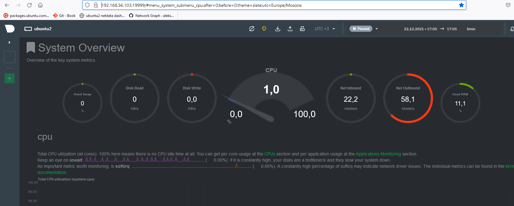

### 1. На лекции мы познакомились с node_exporter. В демонстрации его исполняемый файл запускался в background. Этого достаточно для демо, но не для настоящей production-системы, где процессы должны находиться под внешним управлением. Используя знания из лекции по systemd, создайте самостоятельно простой unit-файл для node_exporter:

*создан файл сервиса  /etc/systemd/system/node_exporter.service*

```
root@ubuntu2:/node_exporter-1.3.1.linux-amd64# cat /etc/systemd/system/node_exporter.service
[Unit]
Description=Node Exporter

[Service]
ExecStart=/node_exporter-1.3.1.linux-amd64/node_exporter
EnvironmentFile=/node_exporter-1.3.1.linux-amd64/node_exporter_env

[Install]
WantedBy=default.target
```

*В файле node_exporter_env задана одна переменная A=b.
PID и системные переменные процесса node_exporter заданные через файл node_exporter_env*

```
vagrant@ubuntu2: ~ $ ps -e |grep node_exporter
15550 ?        00:00:00 node_exporter
vagrant@ubuntu2: ~ $ cat /proc/15550/environ
cat: /proc/15550/environ: Permission denied
vagrant@ubuntu2: ~ $ sudo cat /proc/15550/environ
LANG=en_US.UTF-8LANGUAGE=en_US:PATH=/usr/local/sbin:/usr/local/bin:/usr/sbin:/usr/bin:/sbin:/bin:/snap/binINVOCATION_ID=71d2493788514024812fdb279215ad5eJOURNAL_STREAM=9:110832A=bvagrant@ubuntu2:~$
```

*статус запущенного процесса на локальном компьюторе:*

```
root@ubuntu2:/node_exporter-1.3.1.linux-amd64# systemctl status node_exporter
● node_exporter.service - Node Exporter
   Loaded: loaded (/etc/systemd/system/node_exporter.service; enabled; vendor preset: enabled)
   Active: active (running) since Sun 2021-12-19 19:42:37 UTC; 8min ago
 Main PID: 15550 (node_exporter)
    Tasks: 3 (limit: 3437)
   CGroup: /system.slice/node_exporter.service
           └─15550 /node_exporter-1.3.1.linux-amd64/node_exporter

Dec 19 19:42:37 ubuntu2 node_exporter[15550]: ts=2021-12-19T19:42:37.094Z caller=node_exporter.go:115 level=info collector=thermal_zone
Dec 19 19:42:37 ubuntu2 node_exporter[15550]: ts=2021-12-19T19:42:37.094Z caller=node_exporter.go:115 level=info collector=time
Dec 19 19:42:37 ubuntu2 node_exporter[15550]: ts=2021-12-19T19:42:37.094Z caller=node_exporter.go:115 level=info collector=timex
Dec 19 19:42:37 ubuntu2 node_exporter[15550]: ts=2021-12-19T19:42:37.094Z caller=node_exporter.go:115 level=info collector=udp_queues
Dec 19 19:42:37 ubuntu2 node_exporter[15550]: ts=2021-12-19T19:42:37.094Z caller=node_exporter.go:115 level=info collector=uname
Dec 19 19:42:37 ubuntu2 node_exporter[15550]: ts=2021-12-19T19:42:37.094Z caller=node_exporter.go:115 level=info collector=vmstat
Dec 19 19:42:37 ubuntu2 node_exporter[15550]: ts=2021-12-19T19:42:37.094Z caller=node_exporter.go:115 level=info collector=xfs
Dec 19 19:42:37 ubuntu2 node_exporter[15550]: ts=2021-12-19T19:42:37.094Z caller=node_exporter.go:115 level=info collector=zfs
Dec 19 19:42:37 ubuntu2 node_exporter[15550]: ts=2021-12-19T19:42:37.094Z caller=node_exporter.go:199 level=info msg="Listening on" address=:9100
Dec 19 19:42:37 ubuntu2 node_exporter[15550]: ts=2021-12-19T19:42:37.095Z caller=tls_config.go:195 level=info msg="TLS is disabled." http2=false
```

* поместите его в автозагрузку

*файл помещен в /etc/systemd/system*

* предусмотрите возможность добавления опций к запускаемому процессу через внешний файл (посмотрите, например, на systemctl cat cron),

```
root@ubuntu2:/etc/systemd/system# systemctl cat cron
# /lib/systemd/system/cron.service
[Unit]
Description=Regular background program processing daemon
Documentation=man:cron(8)

[Service]
EnvironmentFile=-/etc/default/cron
ExecStart=/usr/sbin/cron -f $EXTRA_OPTS
IgnoreSIGPIPE=false
KillMode=process

[Install]
WantedBy=multi-user.target
```

* удостоверьтесь, что с помощью systemctl процесс корректно стартует, завершается, а после перезагрузки автоматически поднимается.

*После остановки процесс стартует:*

* Dec 19 20:06:22 ubuntu2 systemd[1]: Stopping Node Exporter...
* Active: active (running) since Sun 2021-12-19 20:06:54 UTC; 2s ago
* Main PID: 15611 (node_exporter)

```
root@ubuntu2:/etc/systemd/system# systemctl stop node_exporter
root@ubuntu2:/etc/systemd/system# systemctl status node_exporter
● node_exporter.service - Node Exporter
  Loaded: loaded (/etc/systemd/system/node_exporter.service; enabled; vendor preset: enabled)
  Active: inactive (dead) since Sun 2021-12-19 20:06:22 UTC; 12s ago
  Process: 15550 ExecStart=/node_exporter-1.3.1.linux-amd64/node_exporter (code=killed, signal=TERM)
  Main PID: 15550 (code=killed, signal=TERM)

Dec 19 19:42:37 ubuntu2 node_exporter[15550]: ts=2021-12-19T19:42:37.094Z caller=node_exporter.go:115 level=info collector=timex
Dec 19 19:42:37 ubuntu2 node_exporter[15550]: ts=2021-12-19T19:42:37.094Z caller=node_exporter.go:115 level=info collector=udp_queues
Dec 19 19:42:37 ubuntu2 node_exporter[15550]: ts=2021-12-19T19:42:37.094Z caller=node_exporter.go:115 level=info collector=uname
Dec 19 19:42:37 ubuntu2 node_exporter[15550]: ts=2021-12-19T19:42:37.094Z caller=node_exporter.go:115 level=info collector=vmstat
Dec 19 19:42:37 ubuntu2 node_exporter[15550]: ts=2021-12-19T19:42:37.094Z caller=node_exporter.go:115 level=info collector=xfs
Dec 19 19:42:37 ubuntu2 node_exporter[15550]: ts=2021-12-19T19:42:37.094Z caller=node_exporter.go:115 level=info collector=zfs
Dec 19 19:42:37 ubuntu2 node_exporter[15550]: ts=2021-12-19T19:42:37.094Z caller=node_exporter.go:199 level=info msg="Listening on" address=:9100
Dec 19 19:42:37 ubuntu2 node_exporter[15550]: ts=2021-12-19T19:42:37.095Z caller=tls_config.go:195 level=info msg="TLS is disabled." http2=false

Dec 19 20:06:22 ubuntu2 systemd[1]: Stopping Node Exporter...
Dec 19 20:06:22 ubuntu2 systemd[1]: Stopped Node Exporter.

root@ubuntu2:/etc/systemd/system# systemctl start node_exporter
root@ubuntu2:/etc/systemd/system# systemctl status node_exporter
● node_exporter.service - Node Exporter
   Loaded: loaded (/etc/systemd/system/node_exporter.service; enabled; vendor preset: enabled)
   Active: active (running) since Sun 2021-12-19 20:06:54 UTC; 2s ago
 Main PID: 15611 (node_exporter)
    Tasks: 3 (limit: 3437)
   CGroup: /system.slice/node_exporter.service
           └─15611 /node_exporter-1.3.1.linux-amd64/node_exporter

Dec 19 20:06:54 ubuntu2 node_exporter[15611]: ts=2021-12-19T20:06:54.429Z caller=node_exporter.go:115 level=info collector=thermal_zone
Dec 19 20:06:54 ubuntu2 node_exporter[15611]: ts=2021-12-19T20:06:54.429Z caller=node_exporter.go:115 level=info collector=time
Dec 19 20:06:54 ubuntu2 node_exporter[15611]: ts=2021-12-19T20:06:54.429Z caller=node_exporter.go:115 level=info collector=timex
Dec 19 20:06:54 ubuntu2 node_exporter[15611]: ts=2021-12-19T20:06:54.429Z caller=node_exporter.go:115 level=info collector=udp_queues
Dec 19 20:06:54 ubuntu2 node_exporter[15611]: ts=2021-12-19T20:06:54.430Z caller=node_exporter.go:115 level=info collector=uname
Dec 19 20:06:54 ubuntu2 node_exporter[15611]: ts=2021-12-19T20:06:54.430Z caller=node_exporter.go:115 level=info collector=vmstat
Dec 19 20:06:54 ubuntu2 node_exporter[15611]: ts=2021-12-19T20:06:54.430Z caller=node_exporter.go:115 level=info collector=xfs
Dec 19 20:06:54 ubuntu2 node_exporter[15611]: ts=2021-12-19T20:06:54.430Z caller=node_exporter.go:115 level=info collector=zfs
Dec 19 20:06:54 ubuntu2 node_exporter[15611]: ts=2021-12-19T20:06:54.430Z caller=node_exporter.go:199 level=info msg="Listening on" address=:9100
Dec 19 20:06:54 ubuntu2 node_exporter[15611]: ts=2021-12-19T20:06:54.430Z caller=tls_config.go:195 level=info msg="TLS is disabled." http2=false
```

*После перезагрузки автоматически поднимается с новым PID 15670, (ранее был PID 15611)*

```
root@ubuntu2:/etc/systemd/system# systemctl restart node_exporter
root@ubuntu2:/etc/systemd/system# systemctl status node_exporter
● node_exporter.service - Node Exporter
   Loaded: loaded (/etc/systemd/system/node_exporter.service; enabled; vendor preset: enabled)
   Active: active (running) since Sun 2021-12-19 20:34:03 UTC; 13s ago
 Main PID: 15670 (node_exporter)
    Tasks: 3 (limit: 3437)
   CGroup: /system.slice/node_exporter.service
           └─15670 /node_exporter-1.3.1.linux-amd64/node_exporter

Dec 19 20:34:03 ubuntu2 node_exporter[15670]: ts=2021-12-19T20:34:03.259Z caller=node_exporter.go:115 level=info collector=thermal_zone
Dec 19 20:34:03 ubuntu2 node_exporter[15670]: ts=2021-12-19T20:34:03.259Z caller=node_exporter.go:115 level=info collector=time
Dec 19 20:34:03 ubuntu2 node_exporter[15670]: ts=2021-12-19T20:34:03.259Z caller=node_exporter.go:115 level=info collector=timex
Dec 19 20:34:03 ubuntu2 node_exporter[15670]: ts=2021-12-19T20:34:03.260Z caller=node_exporter.go:115 level=info collector=udp_queues
Dec 19 20:34:03 ubuntu2 node_exporter[15670]: ts=2021-12-19T20:34:03.260Z caller=node_exporter.go:115 level=info collector=uname
Dec 19 20:34:03 ubuntu2 node_exporter[15670]: ts=2021-12-19T20:34:03.260Z caller=node_exporter.go:115 level=info collector=vmstat
Dec 19 20:34:03 ubuntu2 node_exporter[15670]: ts=2021-12-19T20:34:03.260Z caller=node_exporter.go:115 level=info collector=xfs
Dec 19 20:34:03 ubuntu2 node_exporter[15670]: ts=2021-12-19T20:34:03.260Z caller=node_exporter.go:115 level=info collector=zfs
Dec 19 20:34:03 ubuntu2 node_exporter[15670]: ts=2021-12-19T20:34:03.260Z caller=node_exporter.go:199 level=info msg="Listening on" address=:9100
Dec 19 20:34:03 ubuntu2 node_exporter[15670]: ts=2021-12-19T20:34:03.262Z caller=tls_config.go:195 level=info msg="TLS is disabled." http2=false


```

### 2. Ознакомьтесь с опциями node_exporter и выводом /metrics по-умолчанию. Приведите несколько опций, которые вы бы выбрали для базового мониторинга хоста по CPU, памяти, диску и сети.

CPU:

````
vagrant@ubuntu2:/$ curl -s http://localhost:9100/metrics | grep node_cpu
# HELP node_cpu_guest_seconds_total Seconds the CPUs spent in guests (VMs) for each mode.
# TYPE node_cpu_guest_seconds_total counter
node_cpu_guest_seconds_total{cpu="0",mode="nice"} 0
node_cpu_guest_seconds_total{cpu="0",mode="user"} 0
# HELP node_cpu_seconds_total Seconds the CPUs spent in each mode.
# TYPE node_cpu_seconds_total counter
node_cpu_seconds_total{cpu="0",mode="idle"} 2625.27
node_cpu_seconds_total{cpu="0",mode="iowait"} 2.38
node_cpu_seconds_total{cpu="0",mode="irq"} 0
node_cpu_seconds_total{cpu="0",mode="nice"} 0
node_cpu_seconds_total{cpu="0",mode="softirq"} 0.15
node_cpu_seconds_total{cpu="0",mode="steal"} 0
node_cpu_seconds_total{cpu="0",mode="system"} 5.62
node_cpu_seconds_total{cpu="0",mode="user"} 4.63
vagrant@ubuntu2:/$
````

MEMORY

````
...vagrant@ubuntu2:/$ curl -s http://localhost:9100/metrics | grep "node_memory" | grep -v "HELP" | grep -v "TYPE"
node_memory_Active_anon_bytes 3.4852864e+07
node_memory_Active_bytes 1.9470336e+08
node_memory_Active_file_bytes 1.59850496e+08
node_memory_AnonHugePages_bytes 0
node_memory_AnonPages_bytes 3.442688e+07
node_memory_Bounce_bytes 0
node_memory_Buffers_bytes 2.5223168e+07
node_memory_Cached_bytes 4.6688256e+08
node_memory_CmaFree_bytes 0
node_memory_CmaTotal_bytes 0
node_memory_CommitLimit_bytes 2.563284992e+09
node_memory_Committed_AS_bytes 2.54595072e+08
node_memory_DirectMap2M_bytes 3.068133376e+09
node_memory_DirectMap4k_bytes 7.7529088e+07
...
````

DISK:

```
...vagrant@ubuntu2:/$ curl -s http://localhost:9100/metrics | grep "node_disk" | grep -v "HELP" | grep -v "TYPE"
node_disk_info{device="dm-0",major="253",minor="0"} 1
node_disk_info{device="dm-1",major="253",minor="1"} 1
node_disk_info{device="sda",major="8",minor="0"} 1
node_disk_io_now{device="dm-0"} 0
node_disk_io_now{device="dm-1"} 0
node_disk_io_now{device="sda"} 0
node_disk_io_time_seconds_total{device="dm-0"} 6.604
node_disk_io_time_seconds_total{device="dm-1"} 0.07200000000000001
node_disk_io_time_seconds_total{device="sda"} 6.628
node_disk_io_time_weighted_seconds_total{device="dm-0"} 53.416000000000004
node_disk_io_time_weighted_seconds_total{device="dm-1"} 0.08
...
````

NETWORK:

```
...vagrant@ubuntu2:/$ curl -s http://localhost:9100/metrics | grep "node_network" | grep -v "HELP" | grep -v "TYPE"
node_network_address_assign_type{device="eth0"} 0
node_network_address_assign_type{device="eth1"} 0
node_network_address_assign_type{device="lo"} 0
node_network_carrier{device="eth0"} 1
node_network_carrier{device="eth1"} 1
node_network_carrier{device="lo"} 1
...
``````

### 3. Установите в свою виртуальную машину Netdata. Воспользуйтесь готовыми пакетами для установки (sudo apt install -y netdata). После успешной установки:

в конфигурационном файле /etc/netdata/netdata.conf в секции [web] замените значение с localhost на bind to = 0.0.0.0,
добавьте в Vagrantfile проброс порта Netdata на свой локальный компьютер и сделайте vagrant reload:
config.vm.network "forwarded_port", guest: 19999, host: 19999

После успешной перезагрузки в браузере на своем ПК (не в виртуальной машине) вы должны суметь зайти на localhost:19999. Ознакомьтесь с метриками, которые по умолчанию собираются Netdata и с комментариями, которые даны к этим метрикам.

*Установлен netdata и запущен.*

```
netdata.service - Real time performance monitoring
Loaded: loaded (/lib/systemd/system/netdata.service; disabled; vendor preset: enabled)
Active: active (running) since Wed 2021-12-22 13:34:26 UTC; 10s ago
Main PID: 2593 (netdata)
Tasks: 69 (limit: 3437)
CGroup: /system.slice/netdata.service
├─2593 /usr/sbin/netdata -D
├─2607 /usr/sbin/netdata --special-spawn-server
├─2796 bash /usr/libexec/netdata/plugins.d/tc-qos-helper.sh 1
├─2809 /usr/libexec/netdata/plugins.d/nfacct.plugin 1
├─2816 /usr/libexec/netdata/plugins.d/ebpf.plugin 1
├─2817 /usr/libexec/netdata/plugins.d/apps.plugin 1
└─2821 /usr/libexec/netdata/plugins.d/go.d.plugin 1

[web]
web files owner = root
web files group = netdata

# by default do not expose the netdata port
bind to = 0.0.0.0
```



### 4. Можно ли по выводу dmesg понять, осознает ли ОС, что загружена не на настоящем оборудовании, а на системе виртуализации?
*Команда dmesg используется для проверки содержимого или управления буфером кольца ядра.В результате вывода команды dmesg ядро выводит сообщение о KVM, значит ответ "Да, осознает".*
```
vagrant@ubuntu2:~$ sudo dmesg | grep "Hypervisor detected"
[    0.000000] Hypervisor detected: KVM
```
### 5. Как настроен sysctl fs.nr_open на системе по-умолчанию? Узнайте, что означает этот параметр. Какой другой существующий лимит не позволит достичь такого числа (ulimit --help)
fs.nr_open - сообщает какое максимальное количество файловых дискриптеров возможно открыть
* The default value fs.nr_open is 1024*1024 = 1048576.
* The maximum value of fs.nr_open is limited to sysctl_nr_open_max in kernel, which is 2147483584 on x86_64.

Note: The value of "Max open files"(ulimit -n) is limited to fs.nr_open value.*

### 6. Запустите любой долгоживущий процесс (не ls, который отработает мгновенно, а, например, sleep 1h) в отдельном неймспейсе процессов; покажите, что ваш процесс работает под PID 1 через nsenter. Для простоты работайте в данном задании под root (sudo -i). Под обычным пользователем требуются дополнительные опции (--map-root-user) и т.д.

*Создаем процесс в изолированном пространстве*

```vagrant@ubuntu2:/etc$ unshare --fork --pid --mount-proc sleep 1h```

*создалось отдельное дерево процессов 5355*
```
root@ubuntu2:~# ps -ef | grep sleep
root      5350  3903  0 19:11 pts/0    00:00:00 sudo -i unshare --fork --pid --mount-proc sleep 1h
root      5351  5350  0 19:11 pts/0    00:00:00 unshare --fork --pid --mount-proc sleep 1h
root      5355  5351  0 19:11 pts/0    00:00:00 sleep 1h
```

*заходим в namespaсe процесса и видим что sleep под PID1*
```
root@ubuntu2:~# nsenter -t 5355 -p -m
root@ubuntu2:/# ps -ef
UID        PID  PPID  C STIME TTY          TIME CMD
root         1     0  0 19:11 pts/0    00:00:00 sleep 1h
root         2     0  0 19:14 pts/2    00:00:00 -bash
root        15     2  0 19:14 pts/2    00:00:00 ps -ef
```

### 7. Найдите информацию о том, что такое :(){ :|:& };:. Запустите эту команду в своей виртуальной машине Vagrant с Ubuntu 20.04 (это важно, поведение в других ОС не проверялось). Н екоторое время все будет "плохо", после чего (минуты) – ОС должна стабилизироваться. Вызов dmesg расскажет, какой механизм помог автоматической стабилизации. Как настроен этот механизм по-умолчанию, и как изменить число процессов, которое можно создать в сессии?

````
:() создается функция с названием ":"
{ } описано ее поведение (тело)
:|:& вызов себя и вызов себя повторно через логическое ИЛИ; 
& запуск в фоновом режиме
; конец описания функции
: вызов функции ":"
````

*после запуска вывел сообщения о достижении лимита:*
```
: fork: retry: Resource temporarily unavailable
-bash: fork: retry: Resource temporarily unavailable
-bash: fork: retry: Resource temporarily unavailable
-bash: fork: retry: Resource temporarily unavailable
-bash: fork: retry: Resource temporarily unavailable
-bash: fork: retry: Resource temporarily unavailable
-bash: fork: retry: Resource temporarily unavailable
-bash: fork: retry: Resource temporarily unavailable
```
*в журнале dmesg видим запись о том, что помог механизм cgroup*

````
[27806.034979] cgroup: fork rejected by pids controller in /user.slice/user-1000.slice/session-24.scope
````