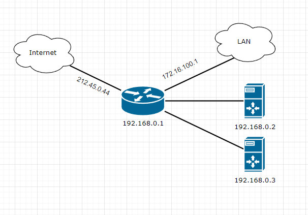

*Ссылка на ДЗ: https://github.com/netology-code/sysadm-homeworks/blob/devsys10/03-sysadmin-08-net/README.md*

### 1. Подключитесь к публичному маршрутизатору в интернет. Найдите маршрут к вашему публичному IP

````
route-views>show ip route 212.45.0.44
Routing entry for 212.45.0.0/19, supernet
  Known via "bgp 6447", distance 20, metric 0
  Tag 6939, type external
  Last update from 64.71.137.241 4d18h ago
  Routing Descriptor Blocks:
  * 64.71.137.241, from 64.71.137.241, 4d18h ago
      Route metric is 0, traffic share count is 1
      AS Hops 2
      Route tag 6939
      MPLS label: none
````

````
	...route-views>show bgp 212.45.0.44/19
BGP routing table entry for 212.45.0.0/19, version 877442
Paths: (23 available, best #22, table default)
  Not advertised to any peer
  Refresh Epoch 1
  7660 2516 6762 8732 8732
    203.181.248.168 from 203.181.248.168 (203.181.248.168)
      Origin IGP, localpref 100, valid, external
      Community: 2516:1050 7660:9003
      path 7FE147F19130 RPKI State not found
      rx pathid: 0, tx pathid: 0
  Refresh Epoch 1
  3333 8732 8732
    193.0.0.56 from 193.0.0.56 (193.0.0.56)
      Origin IGP, localpref 100, valid, external
      Community: 8732:800 8732:1000 8732:8732
      path 7FE1100ECA30 RPKI State not found
      rx pathid: 0, tx pathid: 0
  Refresh Epoch 1
  1351 6939 8732
    132.198.255.253 from 132.198.255.253 (132.198.255.253)
      Origin IGP, localpref 100, valid, external
      path 7FE029BC8038 RPKI State not found
      rx pathid: 0, tx pathid: 0
  Refresh Epoch 1
....
````

### 2. Создайте dummy0 интерфейс в Ubuntu. Добавьте несколько статических маршрутов. Проверьте таблицу маршрутизации.

*Создан dummy0 интерфейс в debian 10;*

*Добавлено несколько статических маршрутов;*

```
@debian ~$ cat /etc/network/interfaces
# This file describes the network interfaces available on your system
# and how to activate them. For more information, see interfaces(5).

source /etc/network/interfaces.d/*

# The loopback network interface
auto lo
iface lo inet loopback


auto enp0s3
iface enp0s3 inet static
        address 192.168.0.226
        netmask 255.255.255.0
        gateway 192.168.0.99

auto dummy0
iface dummy0 inet static
        address 10.2.2.2/32
        pre-up ip link add dummy0 type dummy
        post-down ip link del dummy0
        post-up ip route add 172.16.100.0/24 dev dummy0
        post-up ip route add 172.17.0.0/24 dev dummy0
```

```
@debian ~$ route
Kernel IP routing table
Destination     Gateway         Genmask         Flags Metric Ref    Use Iface
default         192.168.0.99    0.0.0.0         UG    0      0        0 enp0s3
172.16.100.0    0.0.0.0         255.255.255.0   U     0      0        0 dummy0
172.17.0.0      0.0.0.0         255.255.255.0   U     0      0        0 dummy0
192.168.0.0     0.0.0.0         255.255.255.0   U     0      0        0 enp0s3
```

### 3. Проверьте открытые TCP порты в Ubuntu, какие протоколы и приложения используют эти порты? Приведите несколько примеров.

*На моей машине "Program name" не виден:*

````
@debian ~$ netstat -pntul
(Not all processes could be identified, non-owned process info
 will not be shown, you would have to be root to see it all.)
Active Internet connections (only servers)
Proto Recv-Q Send-Q Local Address           Foreign Address         State       PID/Program name
tcp        0      0 0.0.0.0:10000           0.0.0.0:*               LISTEN      -
tcp        0      0 0.0.0.0:80              0.0.0.0:*               LISTEN      -
tcp        0      0 0.0.0.0:22              0.0.0.0:*               LISTEN      -
tcp6       0      0 :::80                   :::*                    LISTEN      -
tcp6       0      0 :::22                   :::*                    LISTEN      -
udp        0      0 0.0.0.0:10000           0.0.0.0:*                           -
udp        0      0 0.0.0.0:41012           0.0.0.0:*                           -
udp        0      0 0.0.0.0:5353            0.0.0.0:*                           -
udp6       0      0 :::59774                :::*                                -
udp6       0      0 :::5353                 :::*                                -
````

*на другой машине Program name виден:*

````
@netbox-test ~# netstat -ntupl
Active Internet connections (only servers)
Proto Recv-Q Send-Q Local Address           Foreign Address         State       PID/Program name
tcp        0      0 0.0.0.0:22              0.0.0.0:*               LISTEN      378/sshd: /usr/sbin
tcp        0      0 127.0.0.1:5432          0.0.0.0:*               LISTEN      11142/postgres
tcp        0      0 127.0.0.1:6379          0.0.0.0:*               LISTEN      13198/redis-server
tcp        0      0 0.0.0.0:10000           0.0.0.0:*               LISTEN      387/perl
tcp6       0      0 :::22                   :::*                    LISTEN      378/sshd: /usr/sbin
tcp6       0      0 ::1:5432                :::*                    LISTEN      11142/postgres
tcp6       0      0 ::1:6379                :::*                    LISTEN      13198/redis-server
udp        0      0 0.0.0.0:68              0.0.0.0:*                           296/dhclient
udp        0      0 0.0.0.0:10000           0.0.0.0:*                           387/perl
````

*здесь наблюдаем несколько tcp-портов (+ некоторые широкоизвестные для примера):*

````
22 - ssh 
21 - FTP
3306 - MySQL
10000 - webmin
80 - http 
5432 - postgres
6379 - redis-server, но данный порт можно назначить динамически
25 -  smtp
465 - SMTPS (SSL/TLS)
````

### 4.Проверьте используемые UDP сокеты в Ubuntu, какие протоколы и приложения используют эти порты?

*В предыдущем выводе, также наблюдаем UDP -порты,
например 68 - DHCP -клиент (+ некоторые широкоизвестные для примера)
513 - syslog  UNIX-система ведения журнала
520 - router Протокол информации о маршрутизации (Routing Information Protocol, RIP)*

### 5. Используя diagrams.net, создайте L3 диаграмму вашей домашней сети или любой другой сети, с которой вы работали.
