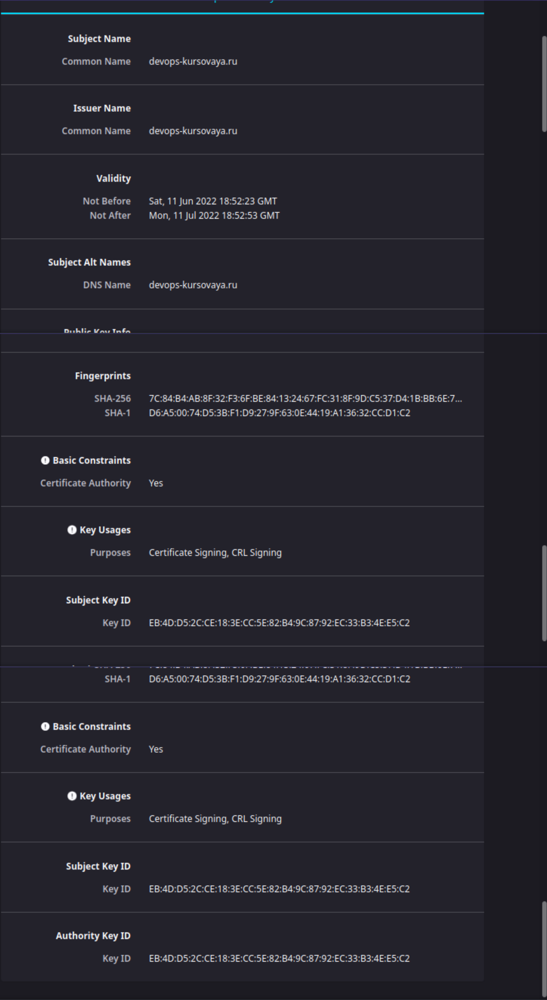
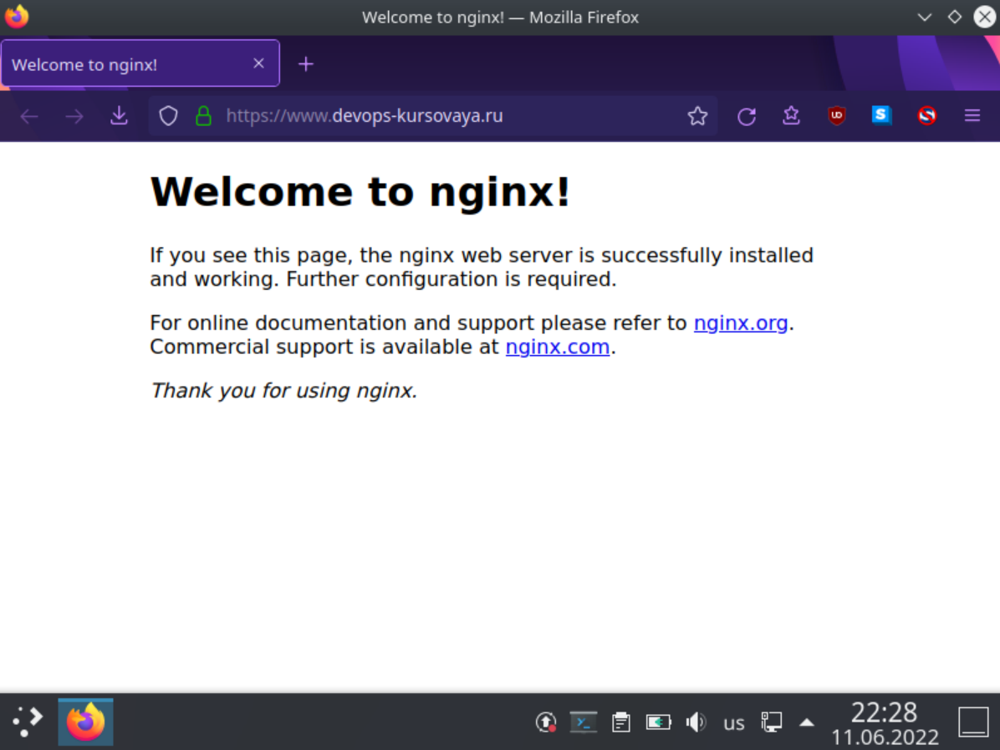
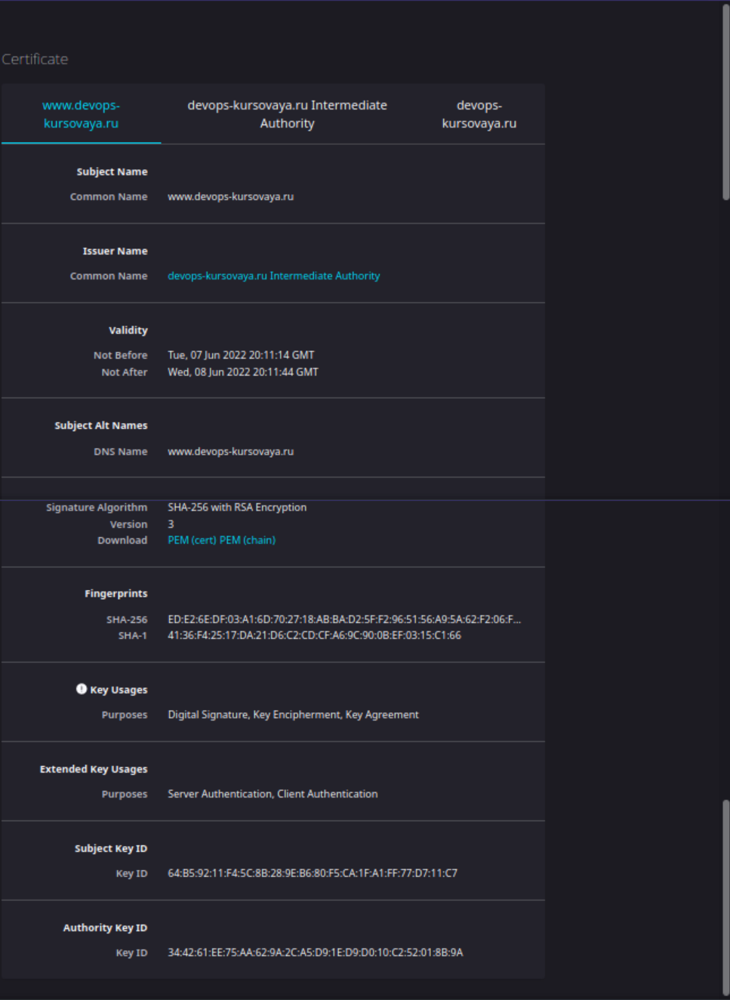

### Процесс установки и настройки `ufw`

#### Устанавливаем `ufw`:
````
root@kursach:/home/defuser# apt install ufw
````

#### Смотрим статус `ufw`:
````
root@kursach:/home/defuser# ufw status verbose
Status: inactive
````

#### Добавляем правило, разрешающее подключение по `ssh`:
````
root@kursach:/home/defuser# ufw allow ssh
Rules updated
Rules updated (v6)
````
````
root@kursach:/home/defuser# ufw enable
Command may disrupt existing ssh connections. Proceed with operation (y|n)? y
Firewall is active and enabled on system startup
````
````
root@kursach:/home/defuser# ufw status
Status: active

To                         Action      From
--                         ------      ----
22/tcp                     ALLOW       Anywhere
22/tcp (v6)                ALLOW       Anywhere (v6)
````
````
root@kursach:/home/defuser# ufw default deny incoming
Default incoming policy changed to 'deny'
(be sure to update your rules accordingly)
````
````
root@kursach:/home/defuser# ufw default allow outgoing
Default outgoing policy changed to 'allow'
(be sure to update your rules accordingly)
````
````
root@kursach:/home/defuser# ufw show listening
tcp:
  22 * (sshd)
   [ 1] allow 22/tcp

tcp6:
  22 * (sshd)
   [ 2] allow 22/tcp

  80 * (apache2)
  
udp:
  47278 * (avahi-daemon)
  5353 * (avahi-daemon)
  631 * (cups-browsed)
  68 192.168.1.74 (NetworkManager)
  
udp6:
  44074 * (avahi-daemon)
  5353 * (avahi-daemon)
  546 fe80::a00:27ff:fe75:adad (NetworkManager)
````
````
root@kursach:/home/defuser# ufw allow from 127.0.0.1 to any
Rule added
````
````
root@kursach:/home/defuser# ufw allow 443
Rule added
Rule added (v6)
````
````
root@kursach:/home/defuser# ufw status
Status: active

To                         Action      From
--                         ------      ----
22/tcp                     ALLOW       Anywhere
Anywhere                   ALLOW       127.0.0.1
443                        ALLOW       Anywhere
22/tcp (v6)                ALLOW       Anywhere (v6)
443 (v6)                   ALLOW       Anywhere (v6)
````

### Процесс установки и выпуска сертификата с помощью hashicorp vault
````
root@kursach:/home/defuser# curl -S https://apt.releases.hashicorp.com/gpg | apt-key add -
  % Total    % Received % Xferd  Average Speed   Time    Time     Time  Current
                                 Dload  Upload   Total   Spent    Left  Speed
  0     0    0     0    0     0      0      0 --:--:-- --:--:-- --:--:--     0Warning: apt-key is deprecated. Manage keyring files in trusted.gpg.d instead (see apt-key(8)).
100  3195  100  3195    0     0   4945      0 --:--:-- --:--:-- --:--:--  4945
OK
````
````
root@kursach:/home/defuser# apt-add-repository "deb [arch=amd64] https://apt.releases.hashicorp.com $(lsb_release -cs) main"
````
````
root@kursach:/home/defuser# apt-get update && apt-get install vault
[...]
````

#### В отдельном терминале запустим `vault` сервер
````
root@kursach:/home/defuser# vault server -dev
````
````
root@kursach:/home/defuser# export VAULT_ADDR=http://127.0.0.1:8200 VAULT_TOKEN=hvs.fN03yrFZtlQsYQS7n7DpKp7S
````

### ----Generate root CA----
````
root@kursach:/home/defuser# vault secrets enable pki
Success! Enabled the pki secrets engine at: pki/
````
````
root@kursach:/home/defuser# vault secrets tune -max-lease-ttl=720h pki
Success! Tuned the secrets engine at: pki/
````
````
root@kursach:/home/defuser# vault write -field=certificate pki/root/generate/internal common_name="devops-kursovaya.ru" ttl=720h > CA_cert.crt
````
````
root@kursach:/home/defuser# vault write pki/config/urls issuing_certificates="$VAULT_ADDR/v1/pki/ca" crl_distribution_points="$VAULT_ADDR/v1/pki/crl"
Success! Data written to: pki/config/urls
````

### ----Generate intermediate CA-----
````
root@kursach:/home/defuser# vault secrets enable -path=pki_int pki
Success! Enabled the pki secrets engine at: pki_int/
````
````
root@kursach:/home/defuser# vault secrets tune -max-lease-ttl=720h pki_int
Success! Tuned the secrets engine at: pki_int/
````
````
root@kursach:/home/defuser# vault write -format=json pki_int/intermediate/generate/internal common_name="devops-kursovaya.ru Intermediate Authority" | jq -r '.data.csr' > pki_intermediate.csr
````
````
root@kursach:/home/defuser# vault write -format=json pki/root/sign-intermediate csr=@pki_intermediate.csr format=pem_bundle ttl="720h" | jq -r '.data.certificate' > intermediate.cert.pem
````
````
root@kursach:/home/defuser# vault write pki_int/intermediate/set-signed certificate=@intermediate.cert.pem
Success! Data written to: pki_int/intermediate/set-signed
````

### ----Create a role-----
````
root@kursach:/home/defuser# vault write pki_int/roles/devops-kursovaya-dot-ru allowed_domains="devops-kursovaya.ru" allow_subdomains=true max_ttl="720h"
Success! Data written to: pki_int/roles/devops-kursovaya-dot-ru
````

### ----Request certificates-----
````
root@kursach:/home/defuser# vault write -format=json pki_int/issue/devops-kursovaya-dot-ru common_name="www.devops-kursovaya.ru" alt_names="www.devops-kursovaya.ru" ttl="24h" > www.devops-kursovaya.ru.crt
````

#### Проверяем добавленный корневой сертификат:


### Процесс установки и настройки сервера nginx

#### Устанавливаем `nginx`:
````
root@kursach:/home/defuser# apt-get install nginx-full
[...]
````
````
root@kursach:/home/defuser# systemctl status nginx
● nginx.service - A high performance web server and a reverse proxy server
     Loaded: loaded (/lib/systemd/system/nginx.service; enabled; vendor preset: enabled)
     Active: active (running) since Sun 2022-06-05 20:39:47 MSK; 1min 6s ago
       Docs: man:nginx(8)
    Process: 35988 ExecStartPre=/usr/sbin/nginx -t -q -g daemon on; master_process on; (code=exited, status=0/SUCCESS)
    Process: 35989 ExecStart=/usr/sbin/nginx -g daemon on; master_process on; (code=exited, status=0/SUCCESS)
   Main PID: 36141 (nginx)
      Tasks: 3 (limit: 4663)
     Memory: 3.4M
        CPU: 25ms
     CGroup: /system.slice/nginx.service
             ├─36141 nginx: master process /usr/sbin/nginx -g daemon on; master_process on;
             ├─36144 nginx: worker process
             └─36145 nginx: worker process

июн 05 20:39:47 kursach systemd[1]: Starting A high performance web server and a reverse proxy server...
июн 05 20:39:47 kursach systemd[1]: Started A high performance web server and a reverse proxy server.
````

#### Парсим сертификат с помощью `jq`:
````
root@kursach:/home/defuser# cat www.devops-kursovaya.ru.crt | jq -r '.data.certificate' > /etc/nginx/ssl/www.devops-kursovaya.ru.crt
root@kursach:/home/defuser# cat www.devops-kursovaya.ru.crt | jq -r '.data.issuing_ca' >> /etc/nginx/ssl/www.devops-kursovaya.ru.crt
root@kursach:/home/defuser# cat www.devops-kursovaya.ru.crt | jq -r '.data.private_key' > /etc/nginx/ssl/www.devops-kursovaya.ru.key
````

#### Правим `nginx.conf`:
````
root@kursach:/home/defuser# vim /etc/nginx/nginx.conf
[...]
server {
                listen              443 ssl;
                server_name         www.example.com;
                ssl_certificate     /etc/nginx/ssl/www.devops-kursovaya.ru.crt;
                ssl_certificate_key /etc/nginx/ssl/www.devops-kursovaya.ru.key;
                ssl_protocols       TLSv1.2 TLSv1.3;
                ssl_ciphers         HIGH:!aNULL:!MD5;
        }
[...]
````

#### Перезапускаем `nginx`:
````
root@kursach:/home/defuser# systemctl restart nginx
````

#### Добавляем соответствие IP и доменного имени в файл `hosts`:
````
root@kursach:/home/defuser# echo "192.168.1.77 www.devops-kursovaya.ru" >> /etc/hosts
````

#### Стартовая страница запускается без предупреждения:


#### Просматриваем конечный сертификат:


#### Делаем жесткую ссылку на файл `.vault-token` в каталог `/etc/nginx/`, тем самым отвязываем регенерацию сертификатов от наличия в системе конкретного пользователя.
````
root@kursach:/home/defuser# ln /root/.vault-token /etc/nginx/
````

#### Создаём скрипт перевыпуска сертификатов:
````
root@kursach:/home/defuser# vi /etc/nginx/renew_crt.sh
````

#### И записываем в файл `renew_crt.sh` следующие строчки:
````
#! /bin/sh

cert=/etc/nginx/ssl/www.devops-kursovaya.ru.crt
key=/etc/nginx/ssl/www.devops-kursovaya.ru.key
tmp=$(mktemp)
VAULT_ADDR='http://127.0.0.1:8200' VAULT_TOKEN=$(cat /etc/nginx/.vault-token) vault write -format=json pki_int/issue/devops-kursovaya-dot-ru common_name="www.devops-kursovaya.ru" alt_names="www.devops-kursovaya.ru" ttl="24h" > $tmp
cat $tmp | jq -r '.data.certificate' > $cert
cat $tmp | jq -r '.data.issuing_ca' >> $cert
cat $tmp | jq -r '.data.private_key' > $key
systemctl reload nginx
rm -f $tmp
````

#### Помещаем скрипт в `crontab`, в порядке тестирования перевыпускаем сертификат каждые пять минут:
````
root@kursach:/home/defuser# echo "5 * * * * root /etc/nginx/renew_crt.sh" >> /etc/crontab
root@kursach:/home/defuser# cat /etc/crontab | grep renew_crt.sh
5 * * * * root /etc/nginx/renew_crt.sh
````

