### Дипломный практикум в YandexCloud

Цели:

* Зарегистрировать доменное имя (любое на ваш выбор в любой доменной зоне).
* Подготовить инфраструктуру с помощью Terraform на базе облачного провайдера YandexCloud.
* Настроить внешний Reverse Proxy на основе Nginx и LetsEncrypt.
* Настроить кластер MySQL.
* Установить WordPress.
* Развернуть Gitlab CE и Gitlab Runner.
* Настроить CI/CD для автоматического развёртывания приложения.
* Настроить мониторинг инфраструктуры с помощью стека: Prometheus, Alert Manager и Grafana.

#### Зарегистрировано доменное имя `aekuzina.site`
#### 
* В YC создан проект `cloud-alleksandra-kuzina`  c каталогом `default`
* В каталоге `default` создан сервисный аккаунт `kuzina` с ролью `editor` и сгенерированы необходимые ключами доступа
* Создан `Object Storage` с бакетом `storagebucket`

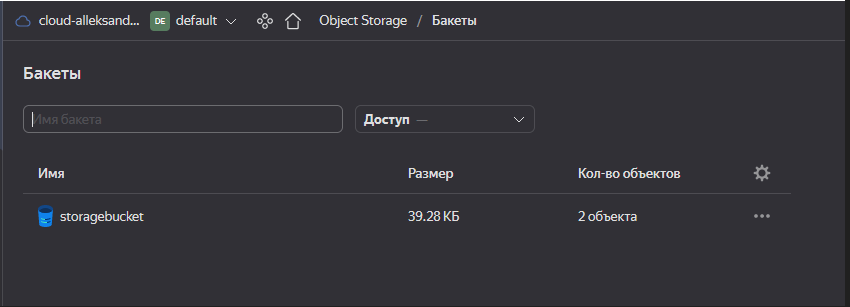

#### Инициализируем terraform и создадим изоляционные среды terraform workspace prod и stage.

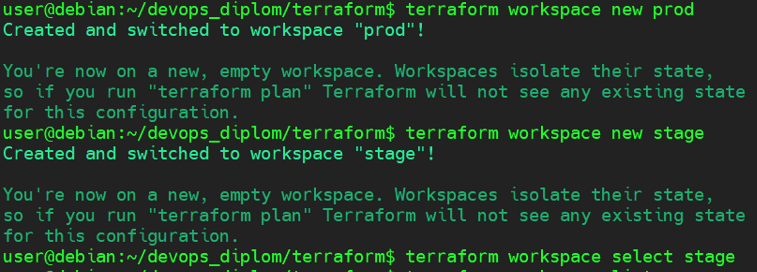

#### Выполним команду `terraform plan` и далее `terraform apply -auto-approve` после 28 минут увидим успешное построение инфраструктуры в YC.

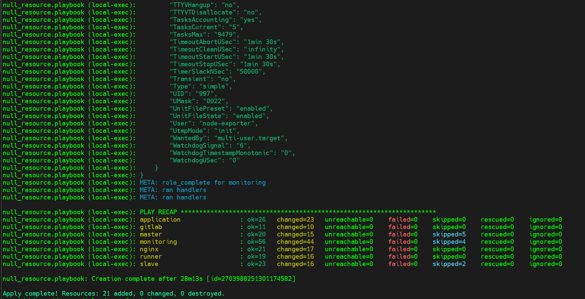

#### В YC после созданий инфраструктуры представлены:
#### Ноды виртуальных машин
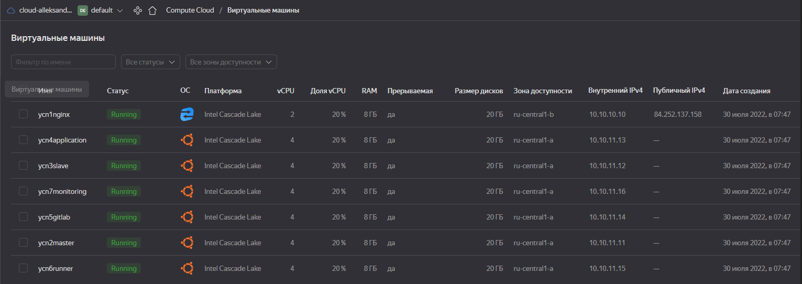
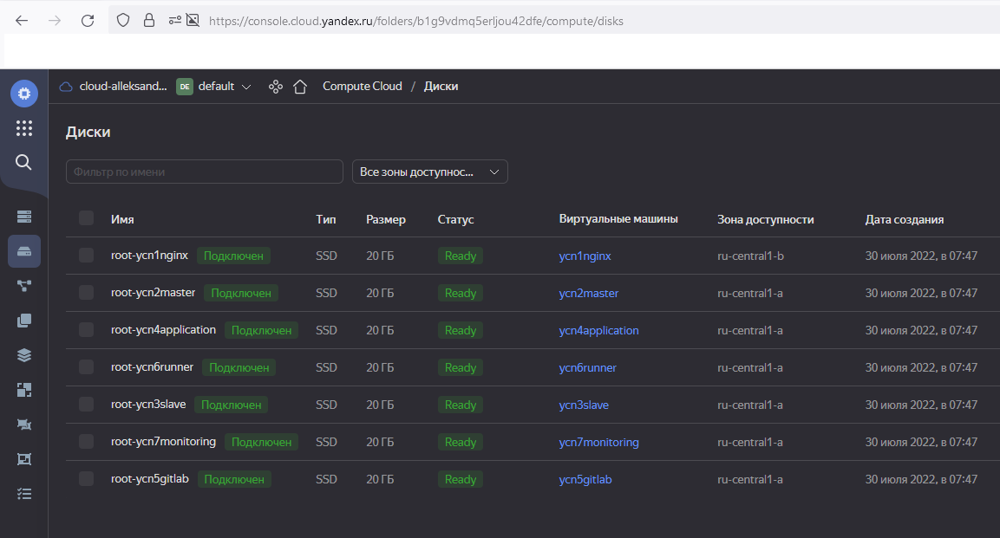
#### Для инфраструктуры было использовано две серых подсети: `10.10.10.0/28` (с минимальным размером маски в YC) для revers-proxy на базе nginx и `10.10.11.0/27` для остальных сервисов располагающихся за Nat reverse-proxy.
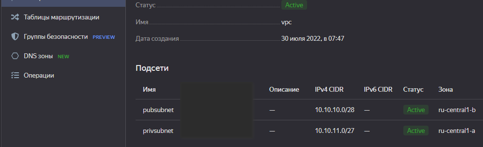
#### Домен `aekuzina.site` был делегирован NS YC. Записи DNS делегированного домена:
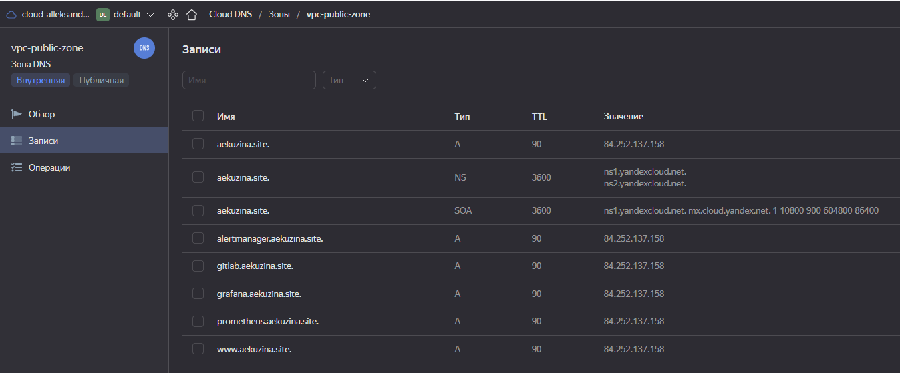

#### После создания инфраструктуры
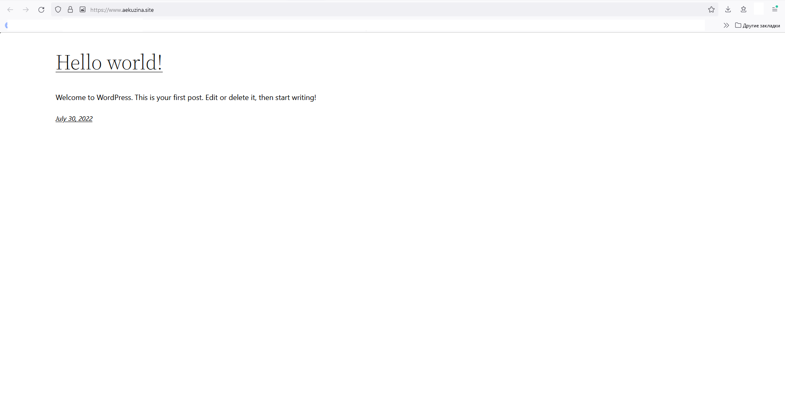

#### Сертификаты
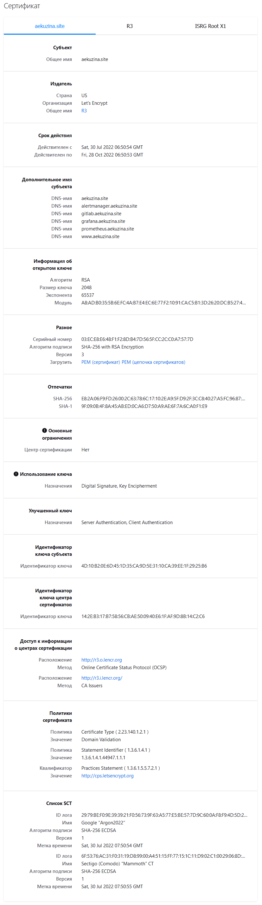

#### GitLab_project_was_successfully_imported
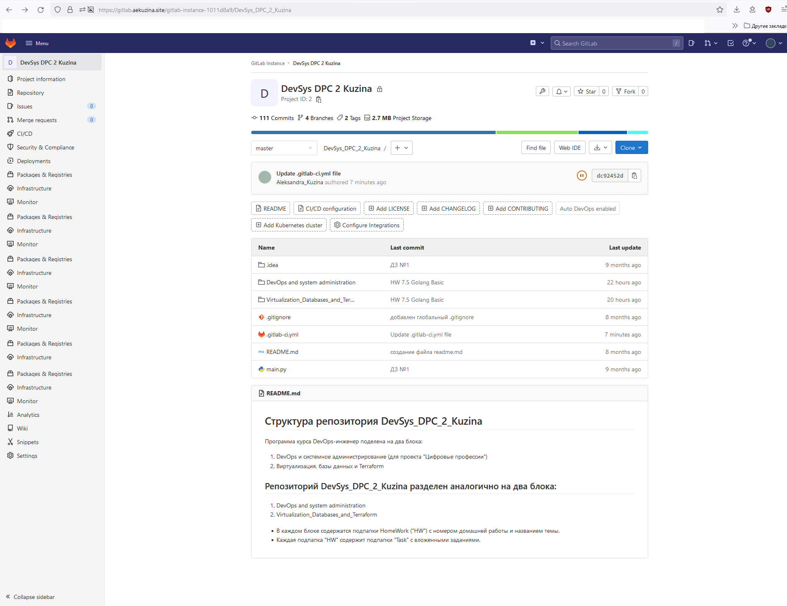

#### GitLab_tag
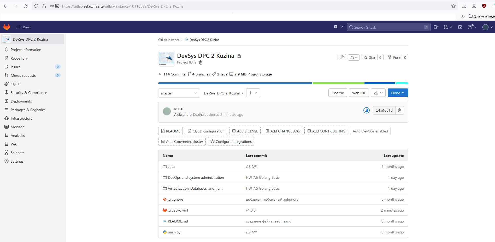

#### GitLab_ranners
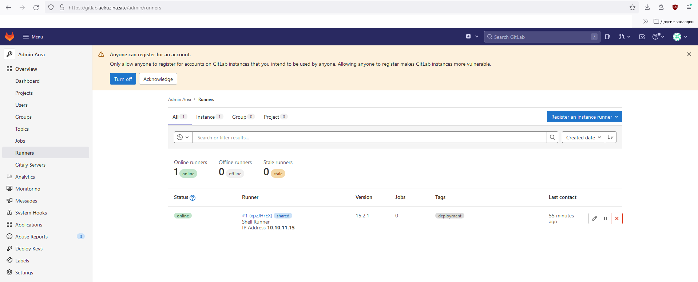

#### Prometheus_runtime_information
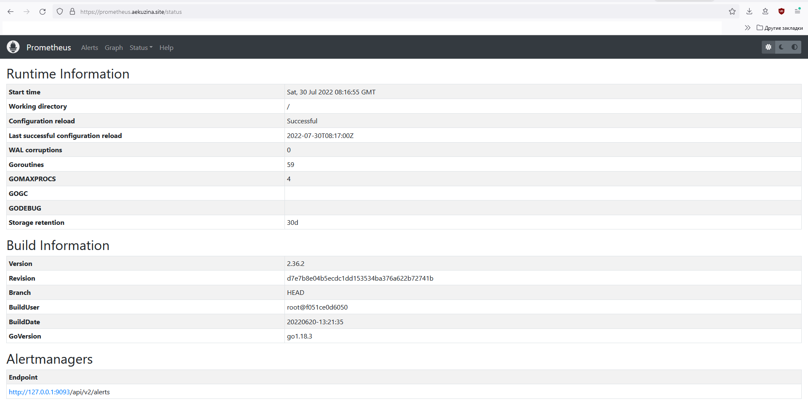

#### Prometheus_targets
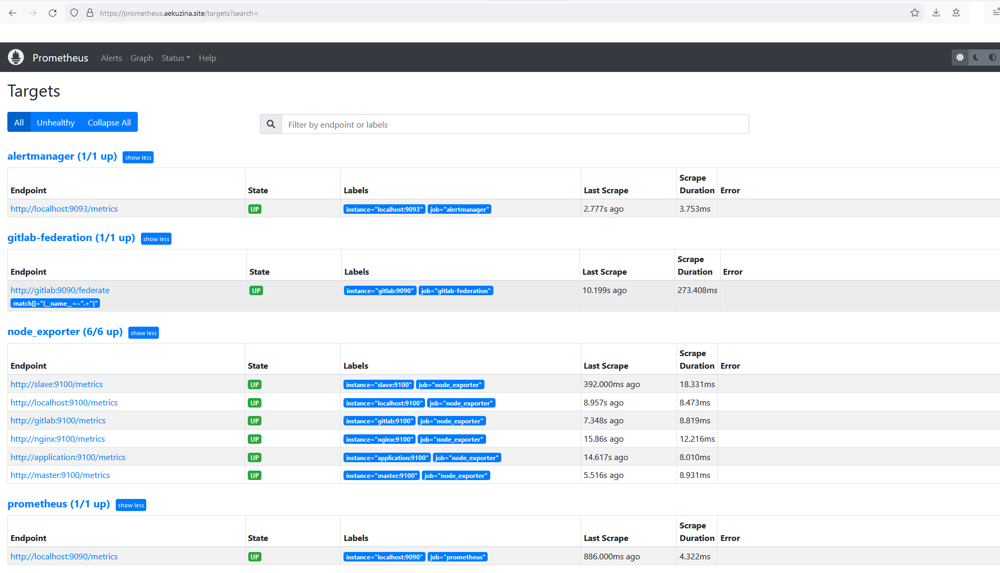

#### Prometheus_alerts
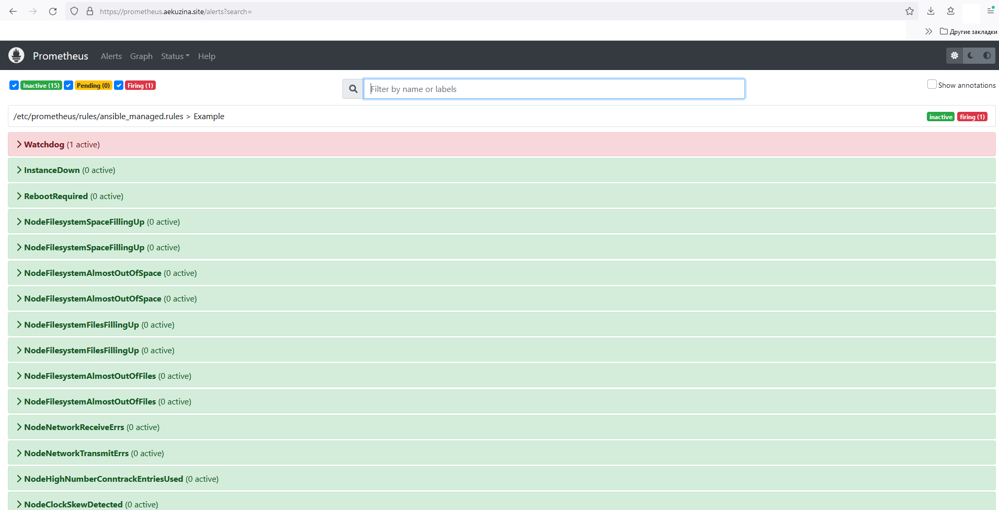

#### alertmanager
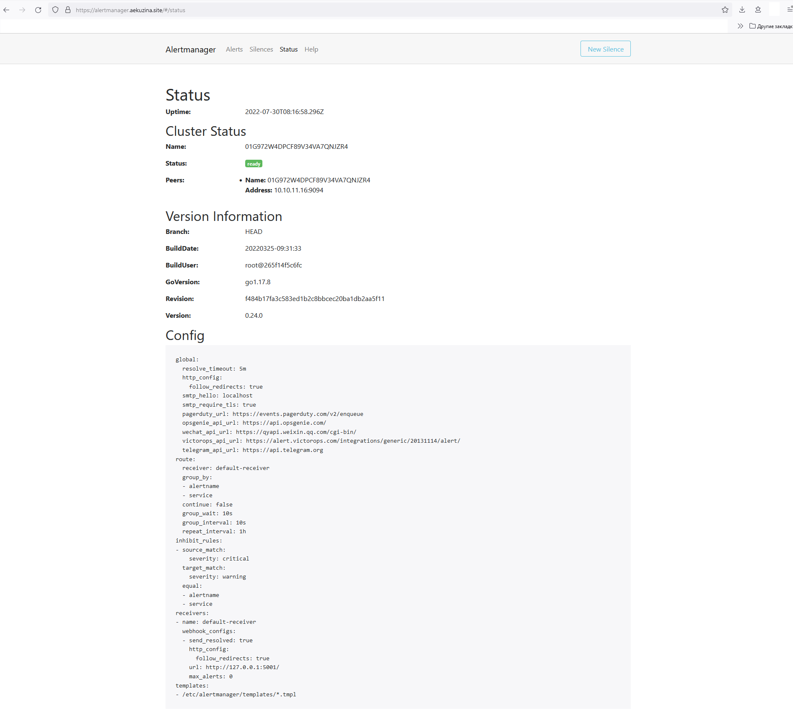

#### alertmanager_filter
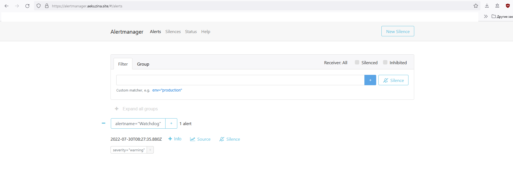

#### grafana_alerting
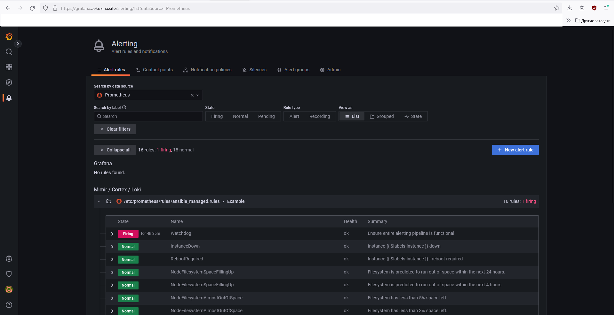

#### grafana_dashboards
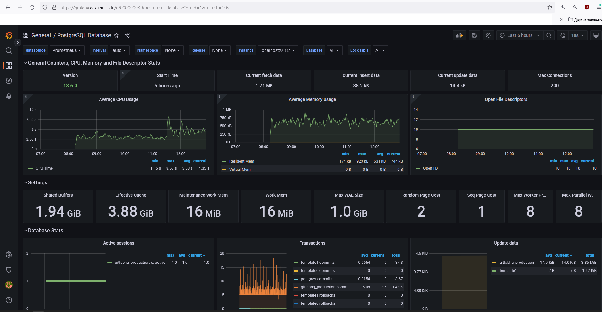

#### grafana_nodeExporterFull
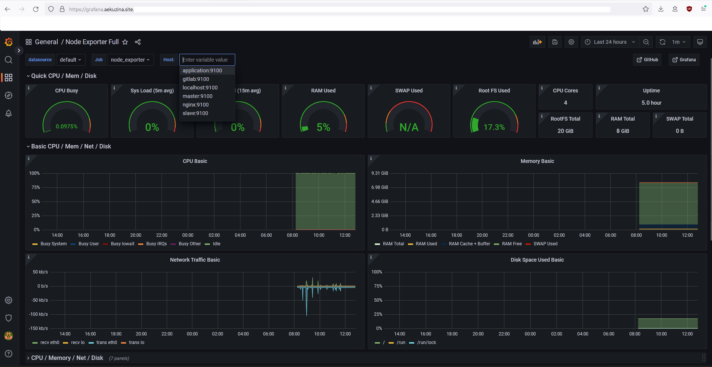

