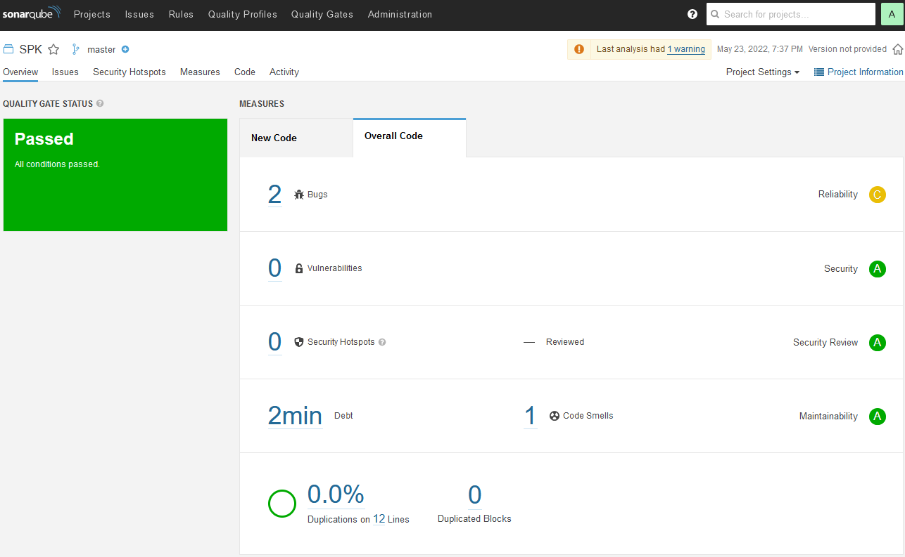
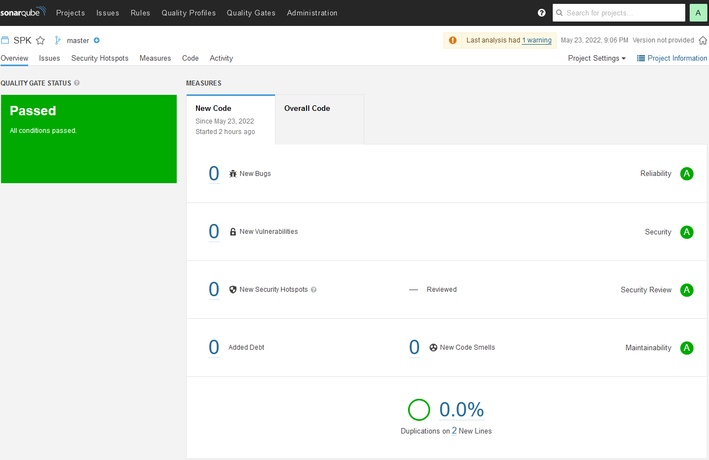
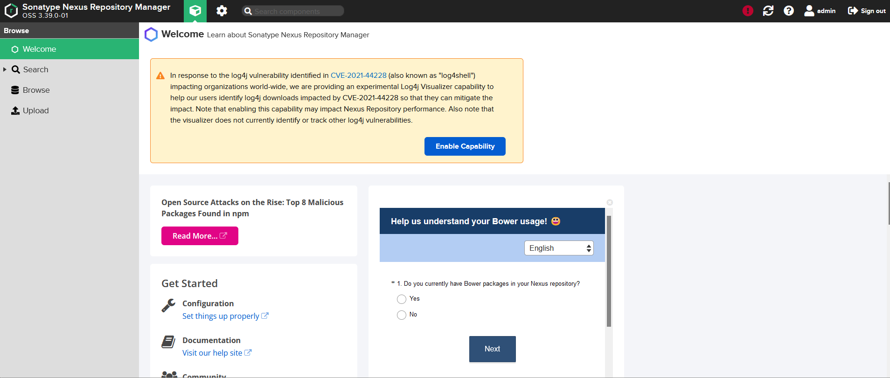
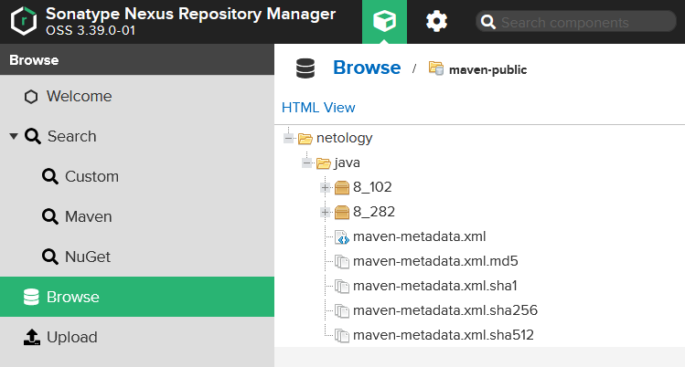
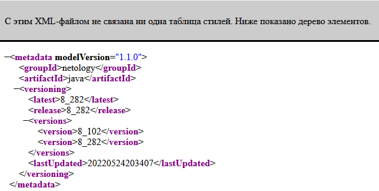

##Знакомство с SonarQube
###Подготовка к выполнению

Скачиваем образ `sonarqube`:
```
root@vagrant:/home/vagrant# docker pull sonarqube:8.7-community
8.7-community: Pulling from library/sonarqube
22599d3e9e25: Pull complete
00bb4d95f2aa: Pull complete
3ef8cf8a60c8: Pull complete
928990dd1bda: Pull complete
07cca701c22e: Pull complete
Digest: sha256:70496f44067bea15514f0a275ee898a7e4a3fedaaa6766e7874d24a39be336dc
Status: Downloaded newer image for sonarqube:8.7-community
docker.io/library/sonarqube:8.7-community
```

Запускаем контейнер `sonarqube`:
```
root@vagrant:/home/vagrant# docker run -d --name sonarqube -e SONAR_ES_BOOTSTRAP_CHECKS_DISABLE=true -p 9000:9000 sonarqube:8.7-community
e4e29a82b188f39719d6a962c42fc9ffd452a5a59e866bca55d52ccb48fbd11c
```

Проверяем статус контейнера с `sonarqube`:
```
root@vagrant:/home/vagrant# docker ps
CONTAINER ID   IMAGE                     COMMAND                  CREATED         STATUS         PORTS                                       NAMES
e4e29a82b188   sonarqube:8.7-community   "bin/run.sh bin/sona…"   6 seconds ago   Up 5 seconds   0.0.0.0:9000->9000/tcp, :::9000->9000/tcp   sonarqube
```

Смотрим логи `sonarqube`:
```
root@vagrant:/home/vagrant# docker logs -f sonarqube
2022.05.23 18:16:44 INFO  app[][o.s.a.AppFileSystem] Cleaning or creating temp directory /opt/sonarqube/temp
2022.05.23 18:16:44 INFO  app[][o.s.a.es.EsSettings] Elasticsearch listening on [HTTP: 127.0.0.1:9001, TCP: 127.0.0.1:46123]
2022.05.23 18:16:44 INFO  app[][o.s.a.ProcessLauncherImpl] Launch process[[key='es', ipcIndex=1, logFilenamePrefix=es]] from [/opt/sonarqube/elasticsearch]: /opt/sonarqube/elasticsearch/bin/elasticsearch
2022.05.23 18:16:44 INFO  app[][o.s.a.SchedulerImpl] Waiting for Elasticsearch to be up and running
~~
2022.05.23 18:18:19 INFO  ce[][o.s.ce.app.CeServer] Compute Engine is operational
2022.05.23 18:18:19 INFO  app[][o.s.a.SchedulerImpl] Process[ce] is up
2022.05.23 18:18:19 INFO  app[][o.s.a.SchedulerImpl] SonarQube is up
2022.05.23 18:18:21 INFO  ce[][o.s.c.t.CeWorkerImpl] worker AYDyJC-KG89XhGXZ8tyS found no pending task (including indexation task). Disabling indexation task lookup for this worker until next SonarQube restart.
```

###Основная часть

Скачиваем архив с `sonar-scanner`:
```
root@vagrant:/home/vagrant# wget https://binaries.sonarsource.com/Distribution/sonar-scanner-cli/sonar-scanner-cli-4.7.0.2747-linux.zip
--2022-05-23 19:03:26--  https://binaries.sonarsource.com/Distribution/sonar-scanner-cli/sonar-scanner-cli-4.7.0.2747-linux.zip
Resolving binaries.sonarsource.com (binaries.sonarsource.com)... 13.32.111.111, 13.32.111.6, 13.32.111.12, ...
Connecting to binaries.sonarsource.com (binaries.sonarsource.com)|13.32.111.111|:443... connected.
HTTP request sent, awaiting response... 200 OK
Length: 43162003 (41M) [application/zip]
Saving to: ‘sonar-scanner-cli-4.7.0.2747-linux.zip’

sonar-scanner-cli-4.7.0.2747-linux.zip              100%[=================================================================================================================>]  41.16M  29.0MB/s    in 1.4s

2022-05-23 19:03:28 (29.0 MB/s) - ‘sonar-scanner-cli-4.7.0.2747-linux.zip’ saved [43162003/43162003]
```

Распаковываем архив:
```
root@vagrant:/home/vagrant# unzip sonar-scanner-cli-4.7.0.2747-linux.zip
Archive:  sonar-scanner-cli-4.7.0.2747-linux.zip
   creating: sonar-scanner-4.7.0.2747-linux/
~~
  sonar-scanner-4.7.0.2747-linux/jre/legal/jdk.internal.vm.compiler.management/LICENSE -> ../java.base/LICENSE
  sonar-scanner-4.7.0.2747-linux/jre/legal/jdk.internal.vm.compiler.management/ADDITIONAL_LICENSE_INFO -> ../java.base/ADDITIONAL_LICENSE_INFO
  sonar-scanner-4.7.0.2747-linux/jre/legal/jdk.internal.vm.compiler.management/ASSEMBLY_EXCEPTION -> ../java.base/ASSEMBLY_EXCEPTION
```

Экспортируем переменную `PATH`:
```
root@vagrant:/home/vagrant# export PATH=$PATH:/home/vagrant/sonar-scanner-4.7.0.2747-linux/bin
```

Проверяем версию `sonar-scanner`:
```
root@vagrant:/home/vagrant# sonar-scanner --version
INFO: Scanner configuration file: /home/vagrant/sonar-scanner-4.7.0.2747-linux/conf/sonar-scanner.properties
INFO: Project root configuration file: NONE
INFO: SonarScanner 4.7.0.2747
INFO: Java 11.0.14.1 Eclipse Adoptium (64-bit)
INFO: Linux 5.4.0-80-generic amd64
```

Запускаем анализатор кода из директории `example` с дополнительным ключом `-Dsonar.coverage.exclusions=fail.py`:
```
root@vagrant:/home/vagrant/mnt-homeworks-master/09-ci-02-cicd/example# sonar-scanner -Dsonar.projectKey=Sonar_Project_Key -Dsonar.sources=. -Dsonar.host.url=http://192.168.1.70:9000 -Dsonar.login=6921c6806456edc8f9de9d22e0939f50cd7188f3 -Dsonar.coverage.exclusions=fail.py
INFO: Scanner configuration file: /home/vagrant/sonar-scanner-4.7.0.2747-linux/conf/sonar-scanner.properties
INFO: Project root configuration file: NONE
~~
INFO: ------------------------------------------------------------------------
INFO: Total time: 4:09.492s
INFO: Final Memory: 16M/237M
INFO: ------------------------------------------------------------------------
```

Смотрим результат в интерфейсе:


Запускаем анализатор повторно:
```
root@vagrant:/home/vagrant/mnt-homeworks-master/09-ci-02-cicd/example# sonar-scanner -Dsonar.projectKey=Sonar_Project_Key -Dsonar.sources=. -Dsonar.host.url=http://192.168.1.70:9000 -Dsonar.login=6921c6806456edc8f9de9d22e0939f50cd7188f3 -Dsonar.coverage.exclusions=fail.py
INFO: Scanner configuration file: /home/vagrant/sonar-scanner-4.7.0.2747-linux/conf/sonar-scanner.properties
INFO: Project root configuration file: NONE
INFO: SonarScanner 4.7.0.2747
~~
INFO: ------------------------------------------------------------------------
INFO: EXECUTION SUCCESS
INFO: ------------------------------------------------------------------------
INFO: Total time: 2:33.547s
INFO: Final Memory: 17M/237M
INFO: ------------------------------------------------------------------------
```

Смотрим финальный результат в интерфейсе:


##Знакомство с Nexus

###Подготовка к выполнению

Скачиваем образ `nexus`:
```
root@vagrant:/home/vagrant# docker pull sonatype/nexus3
Using default tag: latest
latest: Pulling from sonatype/nexus3
f70d60810c69: Pull complete
545277d80005: Pull complete
6e6913462068: Pull complete
10b49635409a: Pull complete
Digest: sha256:3fd7e90bcf49fb55d87d852cab854e5669ed115b09bdb25f47c45ee0797231aa
Status: Downloaded newer image for sonatype/nexus3:latest
docker.io/sonatype/nexus3:latest
```

Запускаем контейнер с `nexus`:
```
root@vagrant:/home/vagrant# docker run -d -p 8081:8081 --name nexus sonatype/nexus3
1c1390a6e415c3b92f3b3026239ca83f7af9083ac654184bf4c34230641994a4
```

Проверяем статус контейнера с `nexus`:
```
root@vagrant:/home/vagrant# docker ps
CONTAINER ID   IMAGE             COMMAND                  CREATED          STATUS          PORTS                                       NAMES
1c1390a6e415   sonatype/nexus3   "sh -c ${SONATYPE_DI…"   31 seconds ago   Up 30 seconds   0.0.0.0:8081->8081/tcp, :::8081->8081/tcp   nexus
```

Смотрим логи `nexus`:
```
root@vagrant:/home/vagrant# docker logs -f nexus
2022-05-24 19:35:48,725+0000 INFO  [FelixStartLevel] *SYSTEM org.sonatype.nexus.pax.logging.NexusLogActivator - start
2022-05-24 19:35:48,896+0000 WARN  [CM Event Dispatcher (Fire ConfigurationEvent: pid=jmx.acl)] *SYSTEM org.apache.felix.fileinstall - File is not writeable: file:/opt/sonatype/nexus/etc/karaf/jmx.acl.cfg
2022-05-24 19:35:48,915+0000 WARN  [CM Event Dispatcher (Fire ConfigurationEvent: pid=org.apache.karaf.log)] *SYSTEM org.apache.felix.fileinstall - File is not writeable: file:/opt/sonatype/nexus/etc/karaf/org.apache.karaf.log.cfg
2022-05-24 19:35:48,929+0000 WARN  [CM Event Dispatcher (Fire ConfigurationEvent: pid=org.apache.karaf.features)] *SYSTEM org.apache.felix.fileinstall - File is not writeable: file:/opt/sonatype/nexus/etc/karaf/org.apache.karaf.features.cfg
~~
2022-05-24 19:40:00,043+0000 INFO  [quartz-9-thread-1] *SYSTEM org.sonatype.nexus.quartz.internal.task.QuartzTaskInfo - Task 'Storage facet cleanup' [repository.storage-facet-cleanup] state change WAITING -> RUNNING
2022-05-24 19:40:00,095+0000 INFO  [quartz-9-thread-1] *SYSTEM org.sonatype.nexus.quartz.internal.task.QuartzTaskInfo - Task 'Storage facet cleanup' [repository.storage-facet-cleanup] state change RUNNING -> WAITING (OK)
2022-05-24 19:50:00,020+0000 INFO  [quartz-9-thread-2] *SYSTEM org.sonatype.nexus.quartz.internal.task.QuartzTaskInfo - Task 'Storage facet cleanup' [repository.storage-facet-cleanup] state change WAITING -> RUNNING
2022-05-24 19:50:00,032+0000 INFO  [quartz-9-thread-2] *SYSTEM org.sonatype.nexus.quartz.internal.task.QuartzTaskInfo - Task 'Storage facet cleanup' [repository.storage-facet-cleanup] state change RUNNING -> WAITING (OK)
```

Узнаём пароль от `admin`:
```
root@vagrant:/home/vagrant# docker exec -it nexus /bin/bash
bash-4.4$
bash-4.4$ cat nexus-data/admin.password
```

Подключаемся под админом, меняем пароль, сохраняем анонимный доступ и смотрим финальный результат в интерфейсе:


###Основная часть

В репозиторий `maven-public` загружаем артефакт с GAV параметрами:
* groupId: netology
* artifactId: java
* version: 8_282
* classifier: distrib
* type: tar.gz
В него же загружаем такой же артефакт, но с version: 8_102

Проверяем, что все файлы загрузились успешно:


Смотрим `maven-metadata.xml`:

[maven-metadata.xml](maven-metadata.xml)

##Знакомство с Maven

###Подготовка к выполнению

Скачиваем образ `maven`:
```
root@vagrant:/home/vagrant# wget https://dlcdn.apache.org/maven/maven-3/3.8.5/binaries/apache-maven-3.8.5-bin.tar.gz
--2022-05-24 20:52:04--  https://dlcdn.apache.org/maven/maven-3/3.8.5/binaries/apache-maven-3.8.5-bin.tar.gz
Resolving dlcdn.apache.org (dlcdn.apache.org)... 151.101.2.132, 2a04:4e42::644
Connecting to dlcdn.apache.org (dlcdn.apache.org)|151.101.2.132|:443... connected.
HTTP request sent, awaiting response... 200 OK
Length: 8673123 (8.3M) [application/x-gzip]
Saving to: ‘apache-maven-3.8.5-bin.tar.gz’

apache-maven-3.8.5-bin.tar.gz                             100%[=====================================================================================================================================>]   8.27M  19.6MB/s    in 0.4s

2022-05-24 20:52:04 (19.6 MB/s) - ‘apache-maven-3.8.5-bin.tar.gz’ saved [8673123/8673123]
```

Распаковываем архив:
```
root@vagrant:/home/vagrant# tar -xzf apache-maven-3.8.5-bin.tar.gz
```

Экспортируем переменную `PATH`:
```
root@vagrant:/home/vagrant# export PATH=$PATH:apache-maven-3.8.5/bin/
```

Проверяем версию `maven`:
```
root@vagrant:/home/vagrant# mvn --version
Apache Maven 3.8.5 (3599d3414f046de2324203b78ddcf9b5e4388aa0)
Maven home: /home/vagrant/apache-maven-3.8.5
Java version: 17.0.3, vendor: Private Build, runtime: /usr/lib/jvm/java-17-openjdk-amd64
Default locale: en_US, platform encoding: UTF-8
OS name: "linux", version: "5.4.0-80-generic", arch: "amd64", family: "unix"
```

###Основная часть

Меняем в `pom.xml` блок с зависимостями под наш артефакт из первого пункта задания для `Nexus` (java с версией 8_282)
Запускаем команду `mvn package` в директории с `pom.xml`, ожидаем успешного окончания:
```
root@vagrant:/home/vagrant/mnt-homeworks-master/09-ci-02-cicd/mvn# mvn package
[INFO] Scanning for projects...
[INFO]
[INFO] --------------------< com.netology.app:simple-app >---------------------
[INFO] Building simple-app 1.0-SNAPSHOT
[INFO] --------------------------------[ jar ]---------------------------------
Downloading from central: https://repo.maven.apache.org/maven2/org/apache/maven/plugins/maven-resources-plugin/2.6/maven-resources-plugin-2.6.pom
Downloaded from central: https://repo.maven.apache.org/maven2/org/apache/maven/plugins/maven-resources-plugin/2.6/maven-resources-plugin-2.6.pom (8.1 kB at 9.8 kB/s)
Downloading from central: https://repo.maven.apache.org/maven2/org/apache/maven/plugins/maven-plugins/23/maven-plugins-23.pom
Downloaded from central: https://repo.maven.apache.org/maven2/org/apache/maven/plugins/maven-plugins/23/maven-plugins-23.pom (9.2 kB at 89 kB/s)
~~
Downloaded from central: https://repo.maven.apache.org/maven2/org/codehaus/plexus/plexus-io/2.0.2/plexus-io-2.0.2.jar (58 kB at 589 kB/s)
Downloaded from central: https://repo.maven.apache.org/maven2/org/codehaus/plexus/plexus-archiver/2.1/plexus-archiver-2.1.jar (184 kB at 1.6 MB/s)
Downloaded from central: https://repo.maven.apache.org/maven2/commons-lang/commons-lang/2.1/commons-lang-2.1.jar (208 kB at 1.1 MB/s)
Downloaded from central: https://repo.maven.apache.org/maven2/org/codehaus/plexus/plexus-utils/3.0/plexus-utils-3.0.jar (226 kB at 1.1 MB/s)
[WARNING] JAR will be empty - no content was marked for inclusion!
[INFO] Building jar: /home/vagrant/mnt-homeworks-master/09-ci-02-cicd/mvn/target/simple-app-1.0-SNAPSHOT.jar
[INFO] ------------------------------------------------------------------------
[INFO] BUILD SUCCESS
[INFO] ------------------------------------------------------------------------
[INFO] Total time:  20.834 s
[INFO] Finished at: 2022-05-24T21:29:32Z
[INFO] ------------------------------------------------------------------------
```

Проверяем директорию `~/.m2/repository/`, находим наш артефакт:
```
root@vagrant:/home/vagrant/mnt-homeworks-master/09-ci-02-cicd/mvn# ls -l ~/.m2/repository/
total 40
drwxr-xr-x 3 root root 4096 May 24 21:29 backport-util-concurrent
drwxr-xr-x 3 root root 4096 May 24 21:29 classworlds
drwxr-xr-x 3 root root 4096 May 24 21:29 com
drwxr-xr-x 3 root root 4096 May 24 21:29 commons-cli
drwxr-xr-x 3 root root 4096 May 24 21:29 commons-lang
drwxr-xr-x 3 root root 4096 May 24 21:29 commons-logging
drwxr-xr-x 3 root root 4096 May 24 21:29 junit
drwxr-xr-x 3 root root 4096 May 24 21:29 log4j
drwxr-xr-x 3 root root 4096 May 24 21:29 netology
drwxr-xr-x 6 root root 4096 May 24 21:29 org
```

Смотрим `pom.xml`:
```
root@vagrant:/home/vagrant/mnt-homeworks-master/09-ci-02-cicd/mvn# cat pom.xml
<project xmlns="http://maven.apache.org/POM/4.0.0" xmlns:xsi="http://www.w3.org/2001/XMLSchema-instance"
  xsi:schemaLocation="http://maven.apache.org/POM/4.0.0 http://maven.apache.org/xsd/maven-4.0.0.xsd">
  <modelVersion>4.0.0</modelVersion>

  <groupId>com.netology.app</groupId>
  <artifactId>simple-app</artifactId>
  <version>1.0-SNAPSHOT</version>
   <repositories>
    <repository>
      <id>my-repo</id>
      <name>maven-public</name>
      <url>http://localhost:8081/repository/maven-public/</url>
    </repository>
  </repositories>
  <dependencies>
   <dependency>
    <groupId>netology</groupId>
    <artifactId>java</artifactId>
    <version>8_282</version>
    <classifier>distrib</classifier>
    <type>tar.gz</type>
   </dependency>
  </dependencies>
</project>
```
[pom.xml](pom.xml)