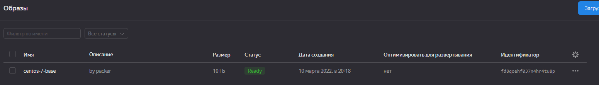
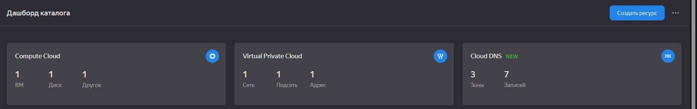
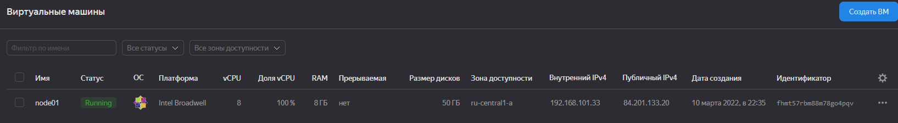
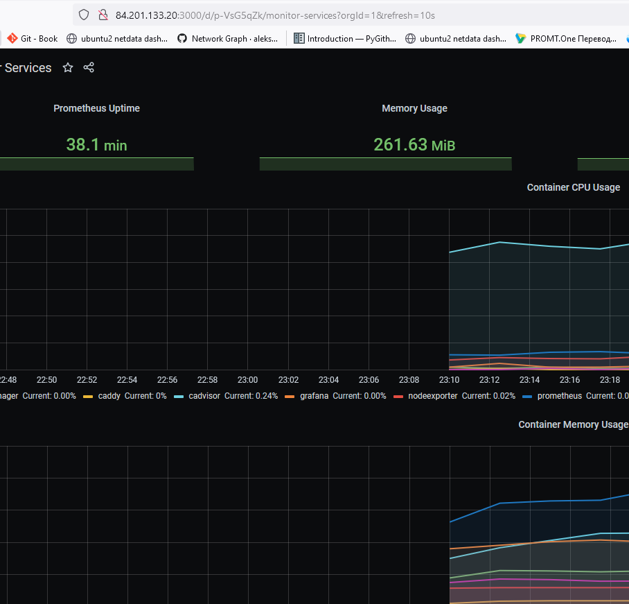

### Задача 1

#### Создать собственный образ операционной системы с помощью Packer. Для получения зачета, вам необходимо предоставить:

* Скриншот страницы, как на слайде из презентации (слайд 37).

````
root@debian11:/home/def_user# yc config list
token: AQAAAAA23_SSAATuwZRVkNLy80xbltRdALQ1dio
cloud-id: b1gppvnbeoehucbhpdrg
folder-id: b1g9vdmq5erljou42dfe
compute-default-zone: ru-central1-a
root@debian11:/home/def_user# yc config list
token: AQAAAAA23_SSAATuwZRVkNLy80xbltRdALQ1dio
cloud-id: b1gppvnbeoehucbhpdrg
folder-id: b1g9vdmq5erljou42dfe
compute-default-zone: ru-central1-a


root@debian11:/home/def_user# yc compute image list
+----+------+--------+-------------+--------+
| ID | NAME | FAMILY | PRODUCT IDS | STATUS |
+----+------+--------+-------------+--------+
+----+------+--------+-------------+--------+

root@debian11:/home/def_user# yc --version
Yandex.Cloud CLI 0.88.0 linux/amd64

root@debian11:/home/def_user# yc vpc network create --name net --labels my-label=netology --description "my first network via yc"
id: enpv9333k4k54ribsjkv
folder_id: b1g9vdmq5erljou42dfe
created_at: "2022-03-09T20:58:42Z"
name: net
description: my first network via yc
labels:
  my-label: netology

root@debian11:/home/def_user# yc vpc subnet create --name my-subnet-a --zone ru-central1-a --range 10.1.2.0/24 --network-name net --description "my first subnet via yc"
id: e9bfg42e2fto5ftnfi5h
folder_id: b1g9vdmq5erljou42dfe
created_at: "2022-03-09T20:59:01Z"
name: my-subnet-a
description: my first subnet via yc
network_id: enpv9333k4k54ribsjkv
zone_id: ru-central1-a
v4_cidr_blocks:
- 10.1.2.0/24

root@vagrant:~# yc compute image list
+----------------------+---------------+--------+----------------------+--------+
|          ID          |     NAME      | FAMILY |     PRODUCT IDS      | STATUS |
+----------------------+---------------+--------+----------------------+--------+
| fd8qoehf037n4hr4tu8p | centos-7-base | centos | f2e5hofc46da1u9fl24s | READY  |
+----------------------+---------------+--------+----------------------+--------+

````


### Задача 2

#### Создать вашу первую виртуальную машину в Яндекс.Облаке. Для получения зачета, вам необходимо предоставить Скриншот страницы свойств созданной ВМ.

````
root@vagrant:~/virt-homeworks-virt-9/05-virt-04-docker-compose/src/terraform# yc iam service-account --folder-id b1g9vdmq5erljou42dfe list
+----+------+
| ID | NAME |
+----+------+
+----+------+

root@vagrant:~/virt-homeworks-virt-9/05-virt-04-docker-compose/src/terraform# yc iam service-account create --name kuzina
id: aje3ocl3dhjjsj9b000t
folder_id: b1g9vdmq5erljou42dfe
created_at: "2022-03-10T19:07:34.622143708Z"
name: kuzina

root@vagrant:~/virt-homeworks-virt-9/05-virt-04-docker-compose/src/terraform# yc iam key create --service-account-name kuzina --output key.json
id: aje008u67r8c7i4nsrbg
service_account_id: aje3ocl3dhjjsj9b000t
created_at: "2022-03-10T19:11:41.128707973Z"
key_algorithm: RSA_2048

````
Создана WM








### Задача 3

#### Создать ваш первый готовый к боевой эксплуатации компонент мониторинга, состоящий из стека микросервисов.

Для получения зачета, вам необходимо предоставить: 
* Скриншот работающего веб-интерфейса Grafana с текущими метриками, как на примере ниже



