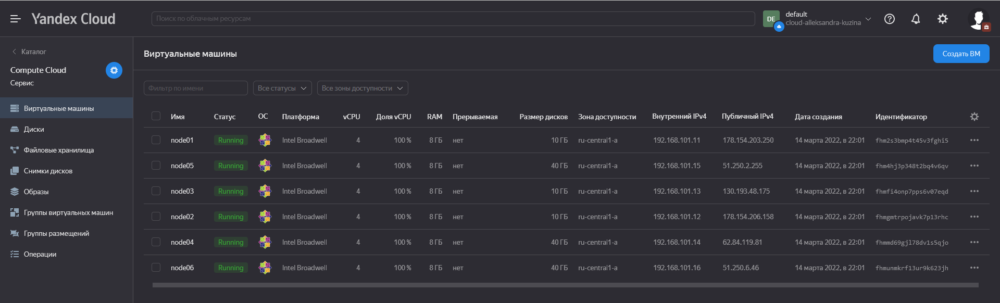
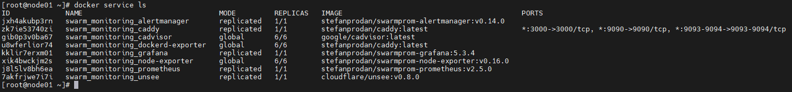

### Задача 1. 

Дайте письменные ответы на следующие вопросы:

* В чём отличие режимов работы сервисов в Docker Swarm кластере: replication и global?

*в global режиме сервисы запускаются на каждой ноде разом и количество реплик ограничено количеством нод в кластере docker swarm.*

*в replication режиме сервисы реплицируются в том количестве которое указано в команде "docker service update --replicas="*

* Какой алгоритм выбора лидера используется в Docker Swarm кластере?

*Алгоритм Raft*

*В кластере должен быть минимум 1 менеджер и более, который/которые могут стать кандидатами в лидеры. Если резервный менеджер долго не получает сообщений от лидера, то он переходит в состояние «кандидат» и посылает другим менеджерам запрос на голосование. Другие менеджеры голосуют за того кандидата, от которого они получили первый запрос. Если кандидат получает сообщение от лидера, то он снимает свою кандидатуру и возвращается в обычное состояние. Если кандидат получает большинство голосов, то он становится лидером. Если же он не получил большинства (это случай, когда на кластере возникли сразу несколько кандидатов и голоса разделились), то кандидат ждёт случайное время и инициирует новую процедуру голосования. Процедура голосования повторяется, пока не будет выбран лидер.*

* Что такое Overlay Network?

*Overlay-сеть создает подсеть, которую могут использовать контейнеры в разных хостах swarm-кластера. Контейнеры на разных физических хостах могут обмениваться данными по overlay-сети (если все они прикреплены к одной сети). Overlay-сеть использует технологию vxlan, которая инкапсулирует layer 2 фреймы в layer 4 пакеты (UDP/IP).*

### Задача 2

* Создать ваш первый Docker Swarm кластер в Яндекс.Облаке
* Для получения зачета, вам необходимо предоставить скриншот из терминала (консоли), с выводом команды:
docker node ls

### Задача 3

* Создать ваш первый, готовый к боевой эксплуатации кластер мониторинга, состоящий из стека микросервисов.
* Для получения зачета, вам необходимо предоставить скриншот из терминала (консоли), с выводом команды: docker service ls

