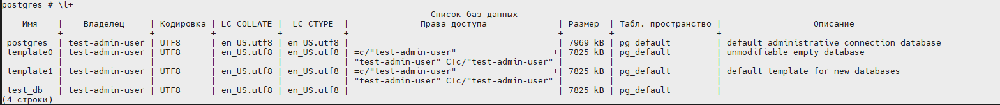

### Задание 1
#### Используя docker поднимите инстанс PostgreSQL (версию 12) c 2 volume, в который будут складываться данные БД и бэкапы
Поднимаем контейнер в docker postgres и смотрим внутри контейнера созданные папки (volume)
```
root@debian11:/home/def_user# docker run --rm --name postgres -e POSTGRES_PASSWORD=123 -e POSTGRES_USER=test-admin-user -e POSTGRES_DB=test_db -d -p 5432:5432 -v $HOME/docker/volumes/backup:/var/lib/postgresql/backup -v $HOME/docker/volumes/data:/var/lib/postgresql/data postgres:12
b005b078d85dad2bfebe72cb0d257bc6bdce4f7ab37ac1a81a4f2afbd4621965
root@debian11:/home/def_user# docker ps -a
CONTAINER ID   IMAGE         COMMAND                  CREATED         STATUS                    PORTS                    NAMES
b005b078d85d   postgres:12   "docker-entrypoint.s…"   7 seconds ago   Up 6 seconds              0.0.0.0:5432->5432/tcp   postgres
6609b067db8d   centos        "/bin/bash"              6 days ago      Exited (0) 41 hours ago                            Centos

root@debian11:/home/def_user# docker exec -it postgres ls -l /var/lib/postgresql
total 8
drwxr-xr-x  2 root     root 4096 Mar 17 14:48 backup
drwx------ 19 postgres root 4096 Mar 19 08:28 data
```
### Задание 2
####  В БД из задачи 1:
    * создайте пользователя test-admin-user и БД test_db
    * в БД test_db создайте таблицу orders и clients (спeцификация таблиц ниже)
    * предоставьте привилегии на все операции пользователю test-admin-user на таблицы БД test_db
    * создайте пользователя test-simple-user
    * предоставьте пользователю test-simple-user права на SELECT/INSERT/UPDATE/DELETE данных таблиц БД test_db 

Заходим внутрь postgres
```
root@debian11:/home/def_user# psql -h 127.0.0.1 -U test-admin-user -d postgres
Пароль пользователя test-admin-user:
```
Список баз данных и пользователей в postgres



Создаем две таблицы в БД

``` 
test_db=# create table orders (id serial primary key, Наименование text, Цена integer);
CREATE TABLE

test_db=# create table clients (id serial primary key, ФИО text, "Страна проживания" text, Заказ integer, foreign key (Заказ) references orders (id));
CREATE TABLE

test_db=# \dt
               Список отношений
 Схема  |   Имя   |   Тип   |    Владелец
--------+---------+---------+-----------------
 public | clients | таблица | test-admin-user
 public | orders  | таблица | test-admin-user
(2 строки)

test_db-# \d+ clients
                                                                Таблица "public.clients"
      Столбец      |   Тип   | Правило сортировки | Допустимость NULL |            По умолчанию             | Хранилище | Цель для статистики | Описание
-------------------+---------+--------------------+-------------------+-------------------------------------+-----------+---------------------+----------
 id                | integer |                    | not null          | nextval('clients_id_seq'::regclass) | plain     |                     |
 ФИО               | text    |                    |                   |                                     | extended  |                     |
 Страна проживания | text    |                    |                   |                                     | extended  |                     |
 Заказ             | integer |                    |                   |                                     | plain     |                     |
Индексы:
    "clients_pkey" PRIMARY KEY, btree (id)
Ограничения внешнего ключа:
    "clients_Заказ_fkey" FOREIGN KEY ("Заказ") REFERENCES orders(id)
Метод доступа: heap

test_db-# \d+ orders
                                                              Таблица "public.orders"
   Столбец    |   Тип   | Правило сортировки | Допустимость NULL |            По умолчанию            | Хранилище | Цель для статистики | Описание
--------------+---------+--------------------+-------------------+------------------------------------+-----------+---------------------+----------
 id           | integer |                    | not null          | nextval('orders_id_seq'::regclass) | plain     |                     |
 Наименование | text    |                    |                   |                                    | extended  |                     |
 Цена         | integer |                    |                   |                                    | plain     |                     |
Индексы:
    "orders_pkey" PRIMARY KEY, btree (id)
Ссылки извне:
    TABLE "clients" CONSTRAINT "clients_Заказ_fkey" FOREIGN KEY ("Заказ") REFERENCES orders(id)
Метод доступа: heap

```
Предоставляем все привелегии на все операции пользователю test-admin-user на таблицы БД test_db
```
test_db=# \dgS+ test-admin-user
                                                   Список ролей
    Имя роли     |                                Атрибуты                                 | Член ролей | Описание
-----------------+-------------------------------------------------------------------------+------------+----------
 test-admin-user | Суперпользователь, Создаёт роли, Создаёт БД, Репликация, Пропускать RLS | {}         |
```

Создаем пользователя test-simple-user и предоставляем ему права на таблицу SELECT/INSERT/UPDATE/DELETE

```
test_db=# CREATE USER "test-simple-user" NOSUPERUSER NOCREATEDB NOCREATEROLE NOINHERIT LOGIN;
CREATE ROLE
test_db=# \dgS+ test*
                                                    Список ролей
     Имя роли     |                                Атрибуты                                 | Член ролей | Описание
------------------+-------------------------------------------------------------------------+------------+----------
 test-admin-user  | Суперпользователь, Создаёт роли, Создаёт БД, Репликация, Пропускать RLS | {}         |
 test-simple-user | Не наследуется                                                          | {}         |

test_db=# select * from information_schema.table_privileges where grantee in ('test-admin-user', 'test-simple-user');
     grantor     |     grantee      | table_catalog |    table_schema    |              table_name               | privilege_type | is_grantable | with_hierarchy
-----------------+------------------+---------------+--------------------+---------------------------------------+----------------+--------------+----------------
 test-admin-user | test-admin-user  | test_db       | public             | clients                               | INSERT         | YES          | NO
 test-admin-user | test-admin-user  | test_db       | public             | clients                               | SELECT         | YES          | YES
 test-admin-user | test-admin-user  | test_db       | public             | clients                               | UPDATE         | YES          | NO
 test-admin-user | test-admin-user  | test_db       | public             | clients                               | DELETE         | YES          | NO
 test-admin-user | test-admin-user  | test_db       | public             | clients                               | TRUNCATE       | YES          | NO
 test-admin-user | test-admin-user  | test_db       | public             | clients                               | REFERENCES     | YES          | NO
 test-admin-user | test-admin-user  | test_db       | public             | clients                               | TRIGGER        | YES          | NO
 test-admin-user | test-simple-user | test_db       | public             | clients                               | INSERT         | NO           | NO
 test-admin-user | test-simple-user | test_db       | public             | clients                               | SELECT         | NO           | YES
 test-admin-user | test-simple-user | test_db       | public             | clients                               | UPDATE         | NO           | NO
 test-admin-user | test-simple-user | test_db       | public             | clients                               | DELETE         | NO           | NO
 test-admin-user | test-admin-user  | test_db       | public             | orders                                | INSERT         | YES          | NO
 test-admin-user | test-admin-user  | test_db       | public             | orders                                | SELECT         | YES          | YES
 test-admin-user | test-admin-user  | test_db       | public             | orders                                | UPDATE         | YES          | NO
 test-admin-user | test-admin-user  | test_db       | public             | orders                                | DELETE         | YES          | NO
 test-admin-user | test-admin-user  | test_db       | public             | orders                                | TRUNCATE       | YES          | NO
 test-admin-user | test-admin-user  | test_db       | public             | orders                                | REFERENCES     | YES          | NO
 test-admin-user | test-admin-user  | test_db       | public             | orders                                | TRIGGER        | YES          | NO
 test-admin-user | test-simple-user | test_db       | public             | orders                                | INSERT         | NO           | NO
 test-admin-user | test-simple-user | test_db       | public             | orders                                | SELECT         | NO           | YES
 test-admin-user | test-simple-user | test_db       | public             | orders                                | UPDATE         | NO           | NO
 test-admin-user | test-simple-user | test_db       | public             | orders                                | DELETE         | NO           | NO


postgres=# \l+
                                                                                    Список баз данных
    Имя    |    Владелец     | Кодировка | LC_COLLATE |  LC_CTYPE  |              Права доступа              | Размер  | Табл. пространство |                  Описание
-----------+-----------------+-----------+------------+------------+-----------------------------------------+---------+--------------------+--------------------------------------------
 postgres  | test-admin-user | UTF8      | en_US.utf8 | en_US.utf8 |                                         | 7969 kB | pg_default         | default administrative connection database
 template0 | test-admin-user | UTF8      | en_US.utf8 | en_US.utf8 | =c/"test-admin-user"                   +| 7825 kB | pg_default         | unmodifiable empty database
           |                 |           |            |            | "test-admin-user"=CTc/"test-admin-user" |         |                    |
 template1 | test-admin-user | UTF8      | en_US.utf8 | en_US.utf8 | =c/"test-admin-user"                   +| 7825 kB | pg_default         | default template for new databases
           |                 |           |            |            | "test-admin-user"=CTc/"test-admin-user" |         |                    |
 test_db   | test-admin-user | UTF8      | en_US.utf8 | en_US.utf8 |                                         | 8129 kB | pg_default         |
(4 строки)
```

### Задание 3 
#### Используя SQL синтаксис - наполните таблицы следующими тестовыми данными: 

Результат выполнения:
```
insert into orders VALUES (1, 'Шоколад', 10), (2, 'Принтер', 3000), (3, 'Книга', 500), (4, 'Монитор', 7000), (5, 'Гитара', 4000);
insert into clients VALUES (1, 'Иванов Иван Иванович', 'USA'), (2, 'Петров Петр Петрович', 'Canada'), (3, 'Иоганн Себастьян Бах', 'Japan'), (4, 'Ронни Джеймс Дио', 'Russia'), (5, 'Ritchie Blackmore', 'Russia');

test_db=# select * from orders;
 id | Наименование | Цена
----+--------------+------
  1 | Шоколад      |   10
  2 | Принтер      | 3000
  3 | Книга        |  500
  4 | Монитор      | 7000
  5 | Гитара       | 4000
(5 строк)

test_db=# select * from clients;
 id |         ФИО          | Страна проживания | Заказ
----+----------------------+-------------------+-------
  1 | Иванов Иван Иванович | USA               |
  2 | Петров Петр Петрович | Canada            |
  3 | Иоганн Себастьян Бах | Japan             |
  4 | Ронни Джеймс Дио     | Russia            |
  5 | Ritchie Blackmore    | Russia            |
(5 строк)
```

### Задание 4
#### Часть пользователей из таблицы clients решили оформить заказы из таблицы orders. Используя foreign keys свяжите записи из таблиц.

Результат выполнения:
```
test_db=# update  clients set Заказ = 3 where id = 1;
update  clients set Заказ = 4 where id = 2;
update  clients set Заказ = 5 where id = 3;
UPDATE 1
UPDATE 1
UPDATE 1
test_db=# select * from clients;
 id |         ФИО          | Страна проживания | Заказ
----+----------------------+-------------------+-------
  4 | Ронни Джеймс Дио     | Russia            |
  5 | Ritchie Blackmore    | Russia            |
  1 | Иванов Иван Иванович | USA               |     3
  2 | Петров Петр Петрович | Canada            |     4
  3 | Иоганн Себастьян Бах | Japan             |     5
```

### Задание 5
#### Получите полную информацию по выполнению запроса выдачи всех пользователей из задачи 4 (используя директиву EXPLAIN). Приведите получившийся результат и объясните что значат полученные значения.

```
test_db=# explain select * from clients where Заказ is not null;
                        QUERY PLAN
-----------------------------------------------------------
 Seq Scan on clients  (cost=0.00..18.10 rows=806 width=72)
   Filter: ("Заказ" IS NOT NULL)
(2 строки)
```

* * Seq Scan — последовательное, блок за блоком, чтение данных таблицы clients.
* * cost - оценка затратности операции. Первое значение 0.00 — затраты на получение первой строки. Второе — 18.10 — затраты на получение всех строк.
* * rows — приблизительное количество возвращаемых строк при выполнении операции Seq Scan.
* * width — средний размер одной строки в байтах.

### Задание 6
* Создайте бэкап БД test_db и поместите его в volume, предназначенный для бэкапов (см. Задачу 1).
* Остановите контейнер с PostgreSQL (но не удаляйте volumes).
* Поднимите новый пустой контейнер с PostgreSQL.
* Восстановите БД test_db в новом контейнере.
* Приведите список операций, который вы применяли для бэкапа данных и восстановления.

*Создаём бэкап БД test_db:*
```
root@debian11:/home/def_user# docker exec -t postgres pg_dump -U test-admin-user test_db -f /var/lib/postgresql/backup/dump_test.sql
```

*Проверяем, создался ли бэкап в контейнере:*
```
root@debian11:/home/def_user# docker exec -t postgres ls -l /var/lib/postgresql/backup/
total 8
-rw-r--r-- 1 root root 4330 Mar 19 21:16 dump_test.sql
```

*Проверяем, отработала ли синхронизация подмонтированной папки на хостовой машине:*
```
root@debian11:/home/def_user# ls -l ~/docker/volumes/backup/
итого 8
-rw-r--r-- 1 root root 4330 мар 19 21:16 dump_test.sql
```

*Останавливаем первый контейнер:*
```
root@debian11:/home/def_user# docker stop postgres
postgres
```
*Запускаем второй контейнер:*
```
root@debian11:/home/def_user# docker run --rm --name postgres2 -e POSTGRES_PASSWORD=123 -e POSTGRES_USER=test-admin-user -e POSTGRES_DB=test_db -d -p 5432:5432 -v $HOME/docker/volumes/backup:/var/lib/postgresql/backup postgres:12
9a55129851e26bf03268f2d75eabf00964de2302e47466665f9f859c0a0a4c3c
```

*Проверяем запущенные контейнеры:*
```
root@debian11:/home/def_user# docker ps
CONTAINER ID   IMAGE         COMMAND                  CREATED              STATUS              PORTS                    NAMES
9a55129851e2   postgres:12   "docker-entrypoint.s…"   About a minute ago   Up About a minute   0.0.0.0:5432->5432/tcp   postgres2
```

*Подключаемся к БД в запущенном контейнере:*
```
root@debian11:/home/def_user# psql -h 127.0.0.1 -U test-admin-user -d test_db
Пароль пользователя test-admin-user:
```

*Проверяем отсутсвие записей в БД test_db:*
```
test_db=# \dt
Отношения не найдены.
test_db=# \d+
Отношения не найдены.
```

*Восстанавливаем БД из бэкапа:*
```
root@debian11:/home/def_user# docker exec -i postgres2 psql -U test-admin-user -d test_db -f /var/lib/postgresql/backup/dump_test.sql
SET
SET
SET
SET
SET
 set_config
------------

(1 row)

SET
SET
SET
SET
SET
SET
CREATE TABLE
ALTER TABLE
CREATE SEQUENCE
ALTER TABLE
ALTER SEQUENCE
CREATE TABLE
ALTER TABLE
CREATE SEQUENCE
ALTER TABLE
ALTER SEQUENCE
ALTER TABLE
ALTER TABLE
COPY 5
COPY 5
 setval
--------
      1
(1 row)

 setval
--------
      1
(1 row)

ALTER TABLE
ALTER TABLE
ALTER TABLE
GRANT
GRANT
```