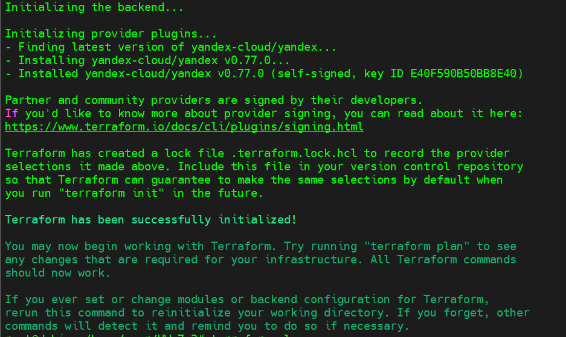
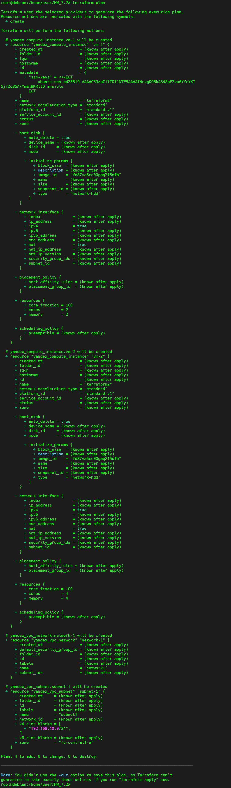

### Задача 1 (Вариант с Yandex.Cloud). Регистрация в ЯО и знакомство с основами 
#### Регистрация и знакомство пройдено

### Задача 2. Создание aws ec2 или yandex_compute_instance через терраформ.
#### В каталоге terraform вашего основного репозитория, который был создан в начале курсе, создайте файл main.tf и versions.tf.
* Созданы два файла `provider.tf` и `variables.tf`
#### В файл main.tf добавьте блок provider, а в versions.tf блок terraform с вложенным блоком required_providers. Укажите любой выбранный вами регион внутри блока provider.

* В файле `provider.tf` указан регион - зона.
```
 zone  = "ru-central1-a"
```
#### В файле main.tf воспользуйтесь блоком data "aws_ami для поиска ami образа последнего Ubuntu.
* В файле `provider.tf` образ последнего ubuntu найден через команду: 
```
root@debian:/home/user# yc compute image list --folder-id standard-images
```
* В файле `provider.tf` образ последнего ubuntu:
````
...
boot_disk {
    initialize_params {
      image_id = "fd87va5cc00gaq2f5qfb"
    }
...
```` 
#### В файле main.tf создайте рессурс  yandex_compute_image.
#### В outputs.tf поместить блоки output с данными об используемых в данный момент:
            AWS account ID,
            AWS user ID,
            AWS регион, который используется в данный момент,
            Приватный IP ec2 инстансы,
            Идентификатор подсети в которой создан инстанс.

* Добавлены в variables.tf `Cloud folder id`  `yandex_cloud_id`  `Cloud token id` , также добавлены сети:
```
resource "yandex_vpc_network" "network-1" {
  name = "network1"
}

resource "yandex_vpc_subnet" "subnet-1" {
  name           = "subnet1"
  zone           = "ru-central1-a"
  network_id     = yandex_vpc_network.network-1.id
  v4_cidr_blocks = ["192.168.10.0/24"]
```
#### Если вы выполнили первый пункт, то добейтесь того, что бы команда terraform plan выполнялась без ошибок.
* `Terraform init` и `terraform plan` выполняется без ошибок:

