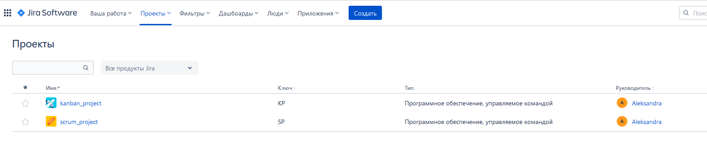
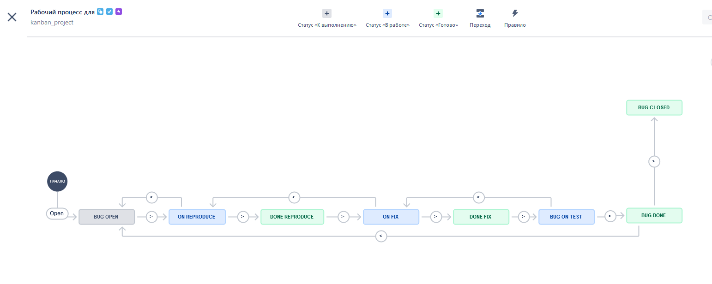
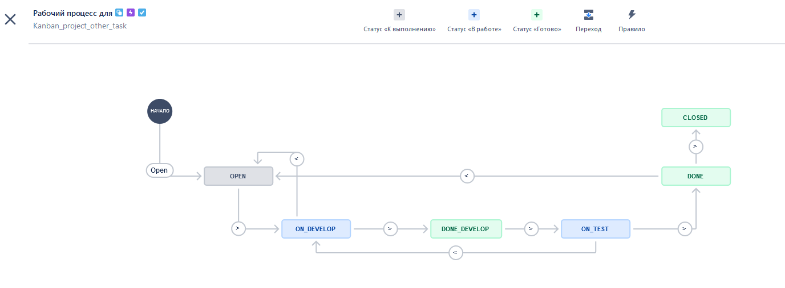

Подготовка к выполнению

    Получить бесплатную JIRA
    Настроить её для своей "команды разработки"
    Создать доски kanban и scrum

#### Созданы проекты и доски kanban и scrum

Основная часть

В рамках основной части необходимо создать собственные workflow для двух типов задач: bug и остальные типы задач. Задачи типа bug должны проходить следующий жизненный цикл:

    Open -> On reproduce
    On reproduce <-> Open, Done reproduce
    Done reproduce -> On fix
    On fix <-> On reproduce, Done fix
    Done fix -> On test
    On test <-> On fix, Done
    Done <-> Closed, Open

Остальные задачи должны проходить по упрощённому workflow:

    Open -> On develop
    On develop <-> Open, Done develop
    Done develop -> On test
    On test <-> On develop, Done
    Done <-> Closed, Open

Создать задачу с типом bug, попытаться провести его по всему workflow до Done. Создать задачу с типом epic, к ней привязать несколько задач с типом task, провести их по всему workflow до Done. При проведении обеих задач по статусам использовать kanban. Вернуть задачи в статус Open. Перейти в scrum, запланировать новый спринт, состоящий из задач эпика и одного бага, стартовать спринт, провести задачи до состояния Closed. Закрыть спринт.

Если всё отработало в рамках ожидания - выгрузить схемы workflow для импорта в XML. Файлы с workflow приложить к решению задания.